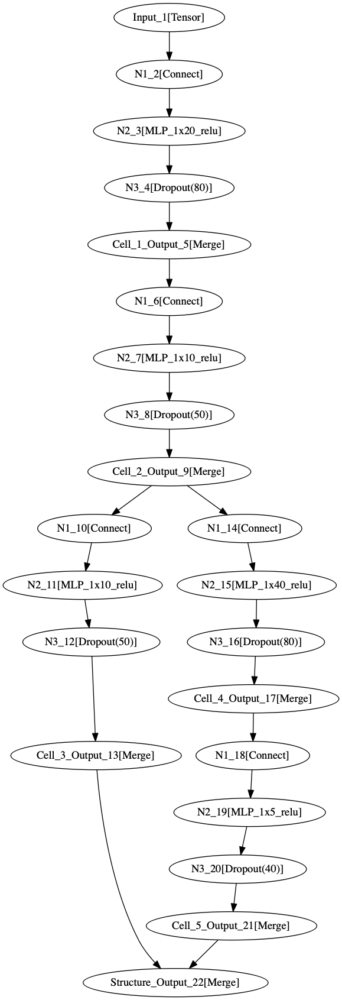
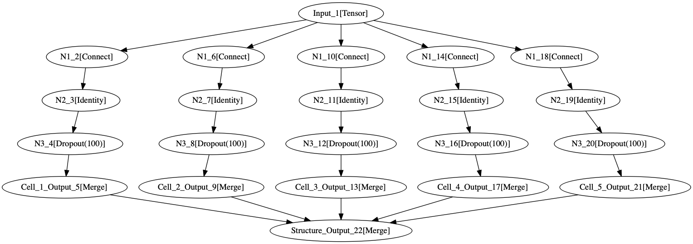

Neural Architecture Search (NAS)
********************************

.. _create-new-nas-problem:

Create a new NAS problem
========================

.. automodule:: deephyper.benchmark.nas

Problem
-------
Let's take the problem of our most simple benchmark as an example ``deephyper.benchmark.nas.linearReg.problem``.

.. literalinclude:: ../../deephyper/benchmark/nas/linearReg/problem.py

Load Data
---------

A ``load_data`` function returns the data of your problem following the interface: ``(train_X, train_Y), (valid_X, valid_Y)``.

.. literalinclude:: ../../deephyper/benchmark/nas/linearReg/load_data.py

Preprocessing
-------------

A preprocessing function is returning an object folling the same interface as `scikit-learn preprocessors <https://scikit-learn.org/stable/modules/preprocessing.html>`_.

::

    from sklearn.pipeline import Pipeline
    from sklearn.preprocessing import StandardScaler


    def stdscaler():
        """
        Return:
            preprocessor:
        """
        preprocessor = Pipeline([
            ('stdscaler', StandardScaler()),
        ])
        return preprocessor

Structure
---------


Here is the structure used for the ```deephyper.benchmark.nas.linearReg`` benchmark.

::

    from deephyper.search.nas.cell.mlp import create_dense_cell_type2
    from deephyper.search.nas.cell.structure import create_seq_struct_full_skipco


    def create_structure(input_tensor, num_cells):
        return create_seq_struct_full_skipco(input_tensor, create_dense_cell_type2, num_cells)


.. figure:: ../_static/img/benchmark/nas/anl_mlp_2_a.png
   :scale: 100 %
   :alt: anl_mlp_2
   :align: center

   A first example of graph generated with ``anl_mlp_2.create_structure``.




   A second example of graph generated with ``anl_mlp_2.create_structure``.



   A last example of graph generated with ``anl_mlp_2.create_structure``.

See :ref:`what-is-structure` for more details

Available benchmarks
====================

============== ================ ========================================
      Neural Architecture Search Benchmarks ``deephyper.benchmark.nas``
------------------------------------------------------------------------
     Name            Type          Description
============== ================ ========================================
 ackleyReg      Regression       Generation of points in N dimensions corresponding to y=f(x) where f is https://www.sfu.ca/~ssurjano/ackley.html
 cifar10        Classification   https://www.cs.toronto.edu/~kriz/cifar.html
 dixonpriceReg  Regression       https://www.sfu.ca/~ssurjano/dixonpr.html
 levyReg        Regression       Generation of points in N dimensions corresponding to y=f(x) where f is https://www.sfu.ca/~ssurjano/levy.html
 linearReg      Regression       Generation of points in N dimensions corresponding to y=x
 mnistNas       Classification   http://yann.lecun.com/exdb/mnist/
 polynome2Reg   Regression       Generation of points in N dimensions corresponding to y=sum(x_i^2)
 saddleReg      Regression       https://en.wikipedia.org/wiki/Saddle_point
============== ================ ========================================
