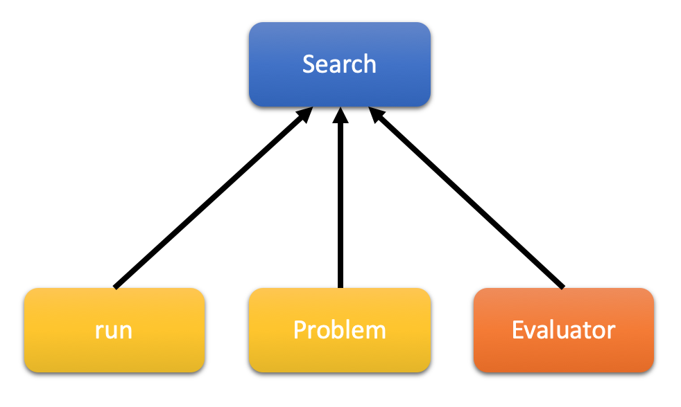

Hyperparameter Search (HPS)
***************************

An hyperparameter search use a problem definition which contain the characteristics of our search space, a model to evaluate and an evaluator to run the model. The model is defined inside a function (corresponding to parameter ``run``). This function must have one argument which is a python ``dict`` object. Inside this dictionary you will have different keys corresponding to the definition of your problem. Let's see how to define a simple problem for hyperparameter search:

::

    >>> from deephyper.benchmark import HpProblem
    >>> Problem = HpProblem()
    >>> Problem.add_dim('nunits', (10, 20), 10)
    >>> print(Problem)
    Problem
    {'nunits': (10, 20)}

    Starting Point
    {'nunits': 10}

So the function which runs the model will receive a dictionary like ``{'nunits': 10}`` but the value of each key will change depending on the choices of the search. Let's see how to define a simple run function for a multi-layer Perceptron model training on mnist data.

::

    '''Trains a simple deep NN on the MNIST dataset.
    Gets to 98.40% test accuracy after 20 epochs
    (there is *a lot* of margin for parameter tuning).
    2 seconds per epoch on a K520 GPU.
    '''

    from __future__ import print_function

    import keras
    from keras.datasets import mnist
    from keras.models import Sequential
    from keras.layers import Dense, Dropout
    from keras.optimizers import RMSprop

    def run(params):
        nunits = params['nunits]

        batch_size = 128
        num_classes = 10
        epochs = 20

        # the data, split between train and test sets
        (x_train, y_train), (x_test, y_test) = mnist.load_data()

        x_train = x_train.reshape(60000, 784)
        x_test = x_test.reshape(10000, 784)
        x_train = x_train.astype('float32')
        x_test = x_test.astype('float32')
        x_train /= 255
        x_test /= 255
        print(x_train.shape[0], 'train samples')
        print(x_test.shape[0], 'test samples')

        # convert class vectors to binary class matrices
        y_train = keras.utils.to_categorical(y_train, num_classes)
        y_test = keras.utils.to_categorical(y_test, num_classes)

        model = Sequential()
        model.add(Dense(nunits, activation='relu', input_shape=(784,)))
        model.add(Dropout(0.2))
        model.add(Dense(512, activation='relu'))
        model.add(Dropout(0.2))
        model.add(Dense(num_classes, activation='softmax'))

        model.summary()

        model.compile(loss='categorical_crossentropy',
                    optimizer=RMSprop(),
                    metrics=['accuracy'])

        history = model.fit(x_train, y_train,
                            batch_size=batch_size,
                            epochs=epochs,
                            verbose=1,
                            validation_data=(x_test, y_test))
        score = model.evaluate(x_test, y_test, verbose=0)
        print('Test loss:', score[0])
        print('Test accuracy:', score[1])

        return -score[1]

Now if you want a search with the previous problem and model. Let's suppose that the problem is define inside ``package_name/problem.py`` and the model is define inside ``package_name/mnist_mlp.py``. If you run a search like AMBS with the command line:

::

    python ambs.py --problem package_name.problem.Problem --run package_name.mnist_mlp.run

All search can be used directly with the command line or inside an other python file.
To print the parameters of a search just run ``python search_script.py --help``. For example with AMBS run ``python ambs.py --help``.

Asynchronous Model-Base Search (AMBS)
=====================================

You can download deephyper paper :download:`here <../../downloads/deephyper_final.pdf>`

Environment variable to access the search on Theta: ``DH_AMBS``

Arguments of AMBS :

* ``learner``

    * ``RF`` : Random Forest (default)
    * ``ET`` : Extra Trees
    * ``GBRT`` : Gradient Boosting Regression Trees
    * ``DUMMY`` :
    * ``GP`` : Gaussian process

* ``liar-strategy``

    * ``cl_max`` : (default)
    * ``cl_min`` :
    * ``cl_mean`` :

* ``acq-func`` : Acquisition function

    * ``LCB`` :
    * ``EI`` :
    * ``PI`` :
    * ``gp_hedge`` : (default)

.. autoclass:: deephyper.search.hps.ambs.AMBS
  :members:
