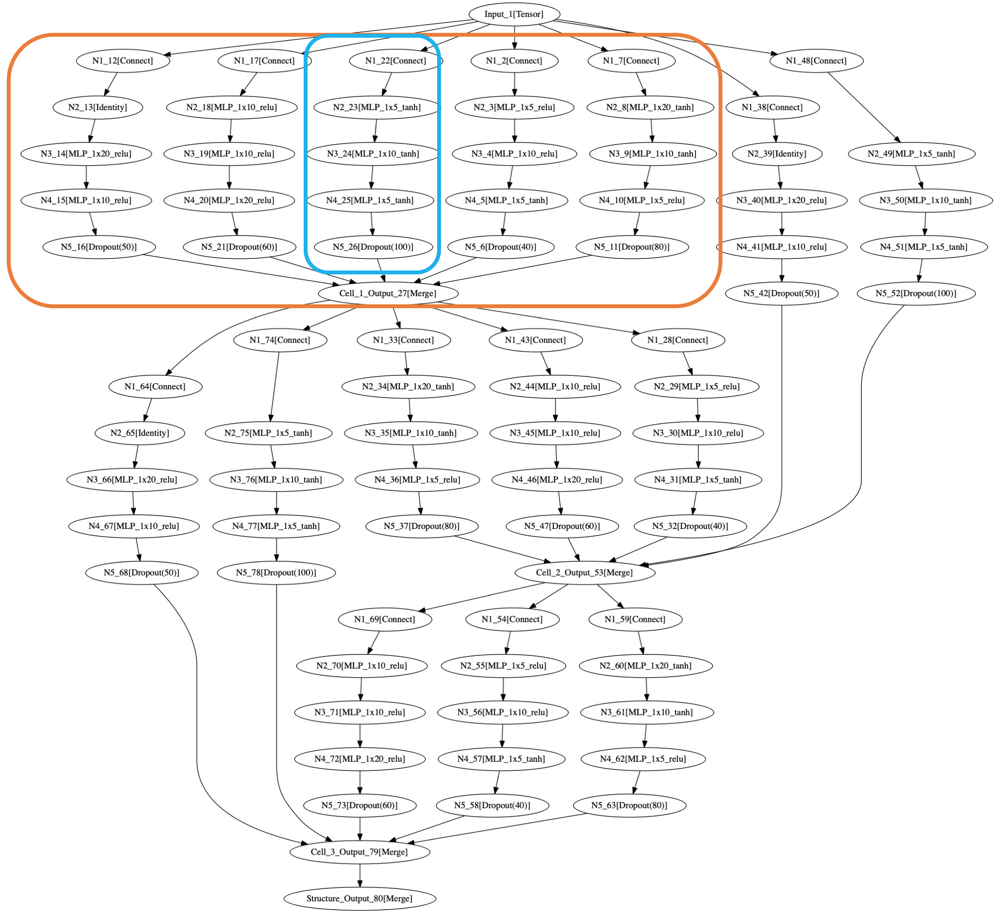
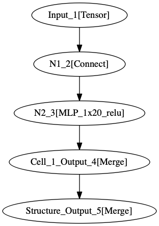
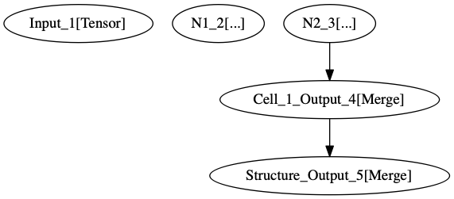

Neural Architecture Search (NAS)
********************************

Structure
=========

.. _what-is-structure:

What is a Structure ?
---------------------

.. WARNING::
    If you want to output the dot files of graphs that you are creating with the nas api please install pygraphviz: ``pip install pygrapviz``

In neural architecture search we have an agent who is producing a sequence of actions to build an architecture. In deephyper we are bringing a specific API to define the action space of this agent which is located in two modules: ``deephyper.search.nas.cell`` and ``deephyper.search.nas.operation``. Let's start with an example of a structure with the following figure:

The previous image represents a specific choice of operations in a ``SequentialStructure`` with 3 cells (orange), each cell contains 5 blocks (blue), and each block contains 5 nodes. Let's take a more simple structure to understand its purpose:

In the previous figure we have a choice of operations for a very simple structure called ``anl_mlp_toy`` which can be represented with one cell by the following figure:

In this structure we have only 1 cell which contains only 1 block. This block contains 2 nodes, the first one represents the creation of a connection (N1_2), the second one represent the creation of a multi layer Perceptron (N2_3).

TODO

.. _create-new-structure:

Create a new Structure
----------------------

TODO
