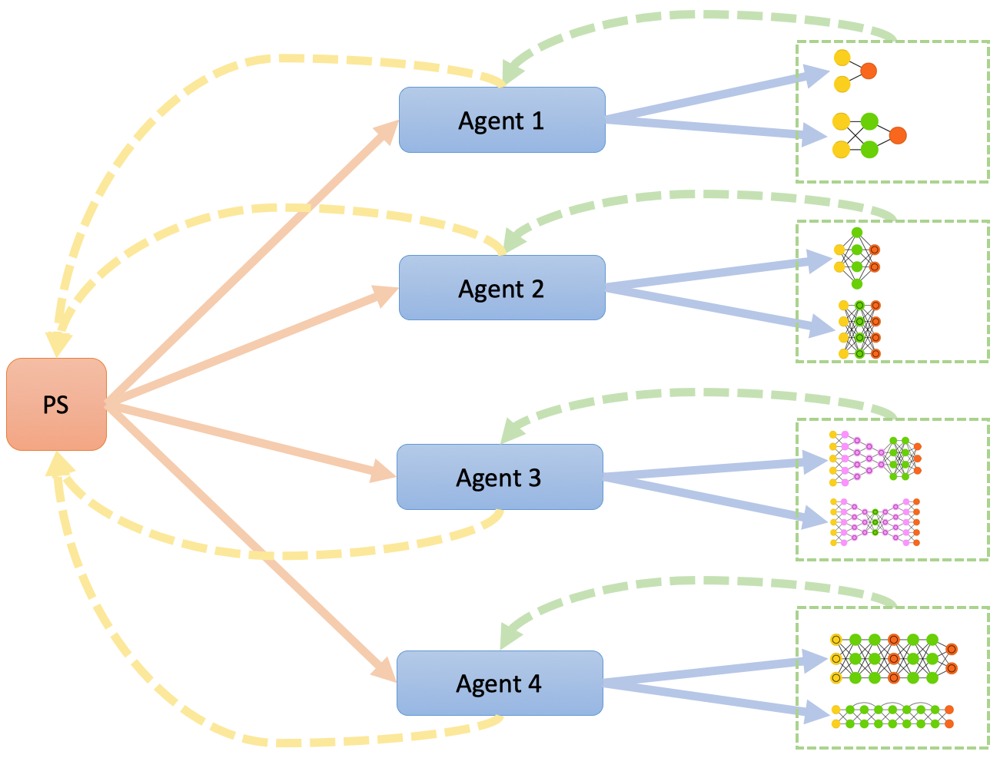
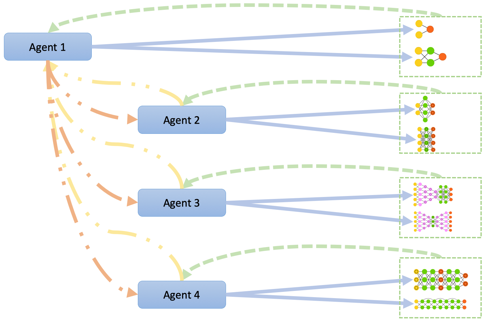

Neural Architecture Search (NAS)
********************************

.. toctree::
   :maxdepth: 2

   agent/index
   env/index
   model/index

NAS A3C (PPO) Asynchronous
==========================

.. automodule:: deephyper.search.nas.nas_a3c_async
   :members:

Run locally
-----------

With n agent where n = np - 1, because 1 mpi process is used for the parameter server.

::

    mpirun -np 2 python nas_a3c_async.py --problem deephyper.benchmark.nas.mnist1D.problem.Problem --run deephyper.search.nas.model.run.alpha.run --evaluator subprocess

NAS A3C (PPO) Synchronous
=========================

.. automodule:: deephyper.search.nas.nas_a3c_sync
   :members:

::

    python -m deephyper.search.nas.nas_a3c_sync --evaluator subprocess --problem 'deephyper.benchmark.nas.linearReg.problem.Problem' --run 'deephyper.search.nas.model.run.alpha.run'

or with MPI to launch n agents, where n = np because all the agent are
 going to be synchronized with the first agent:

::

    mpirun -np 2 python nas_a3c_async.py --problem deephyper.benchmark.nas.mnist1D.problem.Problem --run deephyper.search.nas.model.run.alpha.run --evaluator subprocess

It is important to use the subprocess evaluator.

NAS Random
==========

.. automodule:: deephyper.search.nas.nas_random
   :members:
