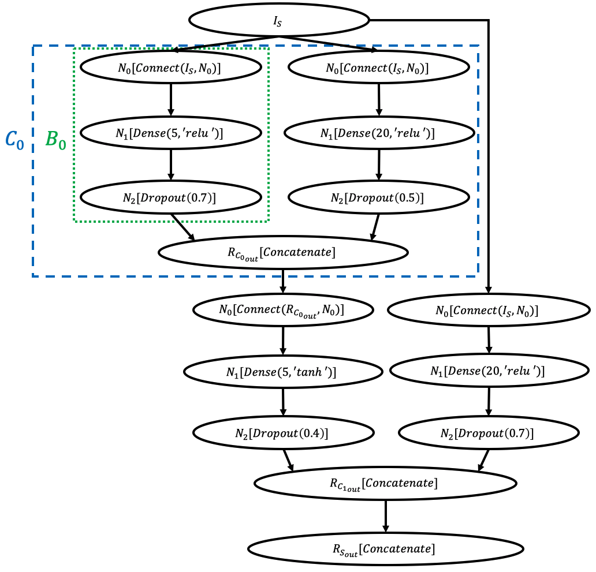

Space
*****

.. toctree::
   :maxdepth: 2

   layers/index
   op/index

Node
====

.. autoclass:: deephyper.search.nas.model.space.node.Node

.. autoclass:: deephyper.search.nas.model.space.node.VariableNode

.. autoclass:: deephyper.search.nas.model.space.node.ConstantNode

.. autoclass:: deephyper.search.nas.model.space.node.MirrorNode

Block
=====

.. autoclass:: deephyper.search.nas.model.space.block.Block

Cell
====

.. autoclass:: deephyper.search.nas.model.space.cell.Cell

Structure
=========

.. autoclass:: deephyper.search.nas.model.space.structure.KerasStructure

.. _what-is-structure:

What is a Structure ?
=====================

.. WARNING::
    If you want to output the dot files of graphs that you are creating with the nas api please install pygraphviz: ``pip install pygrapviz``

In neural architecture search the user needs to define a structure of architecture to run the search. This structure describes the search space of the search.

Definition
----------

Formally a structure :math:`S \in \mathcal{S}` can be described as a triplet of :math:`I_S` the input space, :math:`(C_0, ..., C_{K-1})` a tuple of :math:`K \in \mathbb{N}` cells and :math:`R_{S_{out}}` a rule to apply to create the output of :math:`S`:

:math:`S = (I_S, (C_0, ..., C_{K-1}), R_{S_{out}})`

A cell :math:`C \in \mathcal{C}` is a pair of a tuple of :math:`L \in \mathbb{N}` blocks and :math:`R_{C_{out}}` a rule to apply to create the output of the current cell:

:math:`C = ( (B_0, ..., B_{L-1}), R_{C_{out}})`

A block :math:`B \in \mathcal{B}` is a tuple of :math:`M \in \mathbb{N}` nodes:

:math:`B = ( N_0, ..., N_{M-1} )`

A node :math:`N \in \mathcal{N}` is a pair of an ordered set of :math:`N \in \mathbb{N}` possible operations :math:`\{O_0, ..., O_{N-1}\}` and a choosen operation :math:`O_i \in \{O_0, ..., O_{N-1}\}`:

:math:`N = ( O_i, \{O_0, ..., O_{N-1}\} )`

Visual example
--------------

The following figure is an example of structure which is defined in order to search over fully connected networks. This structure is defined with 2 cells. Each cell contains 1 block. Each block contains 3 nodes. The first node will create a :math:`Connect` operation in order to choose the input of the current block. The second node will choose an operation of kind :math:`Dense(x, y)` where :math:`x` is the number of units in a :math:`Dense` layer and :math:`y` is a string which represents an activation function. A :math:`Dense` layer means that we are doing this operation: :math:`f_{activation}(WX + B)` where :math:`W \in \mathcal{M}_{m,n}(\mathbb{R})` is a matrix of parameters called weights, :math:`X \in \mathbb{R}^n` is a vector of inputs and :math:`B \in \mathbb{R}^m` is a vector of parameters called bias.

NAS API for Deephyper
---------------------

The following code shows functions in python to create the previous example structure. This functions are located in ``deephyper.search.nas.model.baseline.anl_mlp_1``:
::

    import tensorflow as tf

    from deephyper.search.nas.model.baseline.util.struct import create_struct_full_skipco
    from deephyper.search.nas.model.space.block import Block
    from deephyper.search.nas.model.space.cell import Cell
    from deephyper.search.nas.model.space.node import Node
    from deephyper.search.nas.model.space.op.basic import Connect
    from deephyper.search.nas.model.space.op.op1d import (Dense, Identity,
                                                      Dropout)

    def create_dense_cell_type1(input_nodes):
        """Dense type 1

        Args:
            input_nodes (list(Node)): possible inputs of the current cell.

        Returns:
            Cell: a Cell instance.
        """
        cell = Cell(input_nodes)

        def create_block():
            # creation of node N_0
            n0 = Node('N_0')
            for inpt in input_nodes:
                n0.add_op(Connect(cell.graph, inpt, n0))

            # list of operations for node N_1
            mlp_op_list = [
                Identity(),
                Dense(5, tf.nn.relu),
                Dense(5, tf.nn.tanh),
                Dense(10, tf.nn.relu),
                Dense(10, tf.nn.tanh),
                Dense(20, tf.nn.relu),
                Dense(20, tf.nn.tanh)
            ]
            # creation of node N_1
            n1 = Node('N_1')
            for op in mlp_op_list:
                n1add_op(op)

            # list of operations for node N_2
            dropout_ops = [
                Dropout(0.),
                Dropout(0.1),
                Dropout(0.2),
                Dropout(0.3),
                Dropout(0.4),
                Dropout(0.5),
                Dropout(0.6)
            ]
            # creation of node N_2
            n2 = Node('N_2')
            for op in dropout_ops:
                n2.add_op(op)

            # creation of current block with nodes and
            # connections between nodes
            block = Block()
            block.add_node(n0)
            block.add_node(n1)
            block.add_node(n2)

            block.add_edge(n0, n1)
            block.add_edge(n1, n2)
            return block

        # creation of block 0
        block0 = create_block()

        # creation of block 1
        block1 = create_block()

        cell.add_block(block0)
        cell.add_block(block0)

        cell.set_outputs()
        return cell

    def create_structure(input_shape=(2,), output_shape=(1,), num_cells=2):
        return create_struct_full_skipco(
            input_shape,
            output_shape,
            create_dense_cell_type1,
            num_cells)

And here is a test function which choose randomly a set of operations for the structure and then do a prediction in order to check the good construction of the tensor graph:
::

    def test_create_structure():
        from random import random
        from deephyper.search.nas.model.space.structure import KerasStructure
        from deephyper.search.nas.model.baseline.anl_mlp_1 import create_structure

        structure = create_structure((10,), (1,), 2)
        assert type(structure) is KerasStructure

        ops = [random() for i in range(structure.num_nodes)]
        structure.set_ops(ops)
        structure.draw_graphviz('graph_anl_mlp_1_test.dot')

        model = structure.create_model()

        import numpy as np
        x = np.zeros((1, 10))
        y = model.predict(x)

        assert np.shape(y) == (1, 1), f'Wrong output shape {np.shape(y)} should be {(1, 1)}'