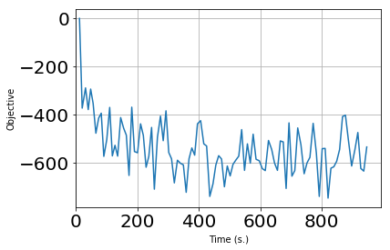
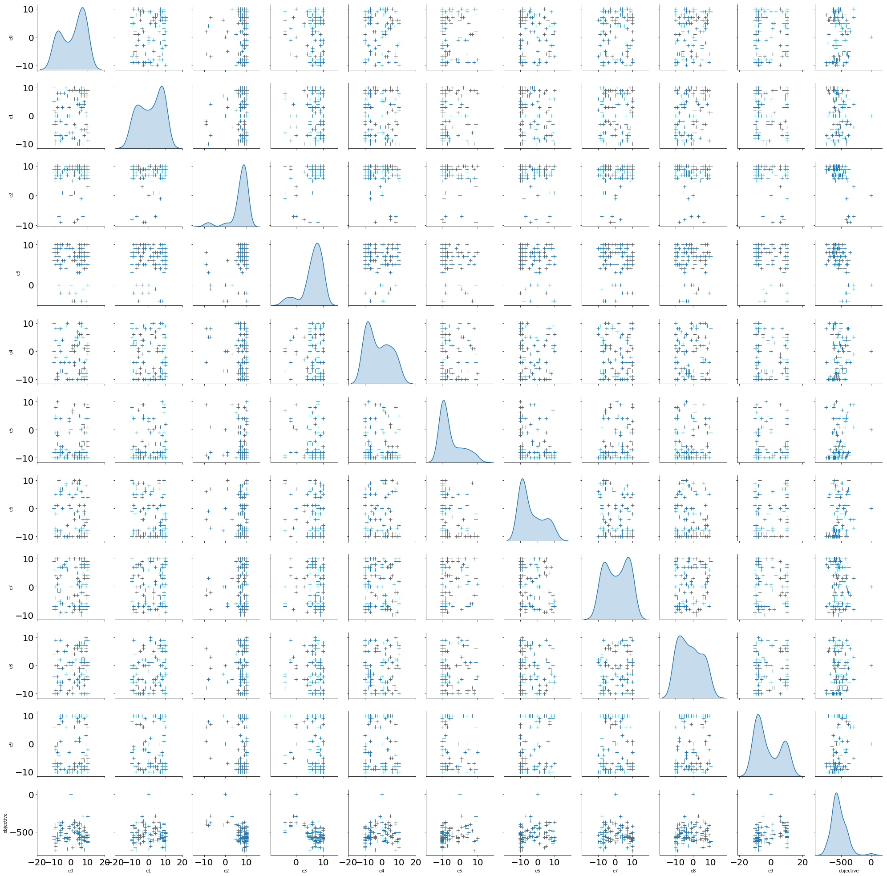
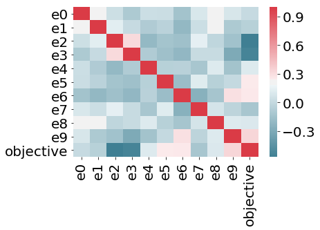

.. _create-new-hps-problem:

Creating a new hyperparameter search problem
********************************************

.. automodule:: deephyper.benchmark.hps

Create the Problem & the model to run
=====================================

For HPS a benchmark is defined by a problem definition and a function
that runs the model::

      deephyper/.../problem_folder/
            __init__.py
            problem.py
            load_data.py
            model_run.py

The problem contains the parameters you want to search over. They are defined
by their name, their space and a default value for the starting point.
Deephyper is using the `Skopt <https://scikit-optimize.github.io/optimizer/index.html>`_,
hence it recognizes three types of parameters:

- a (lower_bound, upper_bound) tuple (for Real or Integer dimensions),
- a (lower_bound, upper_bound, "prior") tuple (for Real dimensions),
- as a list of categories (for Categorical dimensions)

For example if we want to create an hyperparameter search problem for Mnist
with a given starting point:

.. note::
    Many starting points can be defined with ``Problem.add_starting_point(**dims)``. All starting points will be evaluated before generating other evaluations. The starting
    point help the user to bring actual knowledge of the current search space. For
    instance if you know a good set of hyperparameter for your current models.

.. literalinclude:: ../../deephyper/benchmark/hps/mnistmlp/problem.py
    :linenos:
    :caption: deephyper/benchmark/hps/mnistmlp/problem.py
    :name: benchmark-hps-mnistmlp-problem-py

.. note::
    You can notice the ``if __name__ == '__main__'`` at the end of
    :ref:`benchmark-hps-mnistmlp-problem-py` with a ``print(Problem)`` statement.
    Indeed it is well adviced to print the problem after defining it in order to
    make sure the definition is correct. For :ref:`benchmark-hps-mnistmlp-problem-py`
    the output is:
    ::

        Problem
        { 'activation_l1': ['relu', 'elu', 'selu', 'tanh'],
        'activation_l2': ['relu', 'elu', 'selu', 'tanh'],
        'batch_size': (8, 1024),
        'dropout_l1': (0.0, 1.0),
        'dropout_l2': (0.0, 1.0),
        'epochs': (5, 500),
        'nunits_l1': (1, 1000),
        'nunits_l2': (1, 1000)}

        Starting Point
        {0: {'activation_l1': 'relu',
            'activation_l2': 'relu',
            'batch_size': 8,
            'dropout_l1': 0.0,
            'dropout_l2': 0.0,
            'epochs': 5,
            'nunits_l1': 1,
            'nunits_l2': 2}}

and that's it, we just defined a problem with 8 dimensions: ``activation_l1,
activation_l2, batch_size, dropout_l1, dropout_l2, epochs, nunits_l1,
nunits_l2``. Now the problem is defined the next step is to define a function
which will run our Mnist model while taking in account the parameters chosen by
the search. This function is returning an objective scalar value which is
minimized by the hyperparameter search algorithm. For our Mnist problem we want
to maximize the accuracy so the return value is ``return -score[1]``.

.. literalinclude:: ../../deephyper/benchmark/hps/mnistmlp/mnist_mlp.py
    :linenos:
    :caption: deephyper/benchmark/hps/mnistmlp/mnist_mlp.py
    :name: benchmark-hps-mnistmlp-mnist_mlp-py

.. note::
    A ``dict`` is passed to the function running the model. In :ref:`benchmark-hps-mnistmlp-mnist_mlp-py` the function running the model is ``run``. This ``dict`` will be similar to the starting point ``dict`` of :ref:`benchmark-hps-mnistmlp-problem-py` but with values corresponding to the search choices.

.. note::
    It is well adviced to test the function running the model locally by giving it an
    example ``dict`` corresponding to a point included in the problem definition.
    For example you can use a starting point of your problem ::

        run(Problem.starting_point_asdict[0])

.. WARNING::
    When designing a new optimization experiment, keep in mind ``model_run.py``
    must be runnable from an arbitrary working directory. This means that Python
    modules simply located in the same directory as the ``model_run.py`` will not be
    part of the default Python import path, and importing them will cause an ``ImportError``! For example in :ref:`benchmark-hps-mnistmlp-mnist_mlp-py` we are doing ``import load_data``.

    To ensure that modules located alongside the ``model_run.py`` script are
    always importable, a quick workaround is to explicitly add the problem
    folder to ``sys.path`` at the top of the script:

    .. code-block:: python
        :linenos:

        import os
        import sys
        here = os.path.dirname(os.path.abspath(__file__))
        sys.path.insert(0, here)
        # import user modules below here

    .. literalinclude:: ../../deephyper/benchmark/hps/mnistmlp-script/mnist_mlp.py
        :linenos:
        :caption: deephyper/benchmark/hps/mnistmlp-script/mnist_mlp.py
        :name: benchmark-hps-mnistmlp-script-mnist_mlp-py

.. highlight:: console

Assuming you have installed ``deephyper`` in your environment we will show you
how to run an asynchronous model-based search (AMBS) on a benchmark included
within deephyper. To print the arguments of a search like AMBS just run::

    python -m deephyper.search.hps.ambs --help

The expected output is::

    usage: ambs.py [-h] [--problem PROBLEM] [--run RUN] [--backend BACKEND]
               [--max-evals MAX_EVALS]
               [--eval-timeout-minutes EVAL_TIMEOUT_MINUTES]
               [--evaluator {balsam,subprocess,processPool,threadPool}]
               [--learner {RF,ET,GBRT,DUMMY,GP}]
               [--liar-strategy {cl_min,cl_mean,cl_max}]
               [--acq-func {LCB,EI,PI,gp_hedge}]

    optional arguments:
    -h, --help            show this help message and exit
    --problem PROBLEM     Module path to the Problem instance you want to use
                            for the search (e.g.
                            deephyper.benchmark.hps.polynome2.Problem).
    --run RUN             Module path to the run function you want to use for
                            the search (e.g.
                            deephyper.benchmark.hps.polynome2.run).
    --backend BACKEND     Keras backend module name
    --max-evals MAX_EVALS
                            maximum number of evaluations
    --eval-timeout-minutes EVAL_TIMEOUT_MINUTES
                            Kill evals that take longer than this
    --evaluator {balsam,subprocess,processPool,threadPool}
                            The evaluator is an object used to run the model.
    --learner {RF,ET,GBRT,DUMMY,GP}
                            type of learner (surrogate model)
    --liar-strategy {cl_min,cl_mean,cl_max}
                            Constant liar strategy
    --acq-func {LCB,EI,PI,gp_hedge}
                            Acquisition function type

Run an Hyperparameter Search locally
====================================

Now you can run AMBS with custom arguments.

.. WARNING::
    By default a ``subprocess`` evaluator is used.

The python package way
----------------------

This method is used when the *problem* and *run* are installed in the current
python environment. With ``setuptools`` you can easily create a new package
and install it in your current python environment::

    python -m deephyper.search.hps.ambs --problem deephyper.benchmark.hps.mnistmlp.problem.Problem --run deephyper.benchmark.hps.mnistmlp.mnist_mlp.run

.. note::
    ``deephyper.benchmark.hps.mnistmlp.problem.Problem`` and ``deephyper.benchmark.hps.mnistmlp.mnist_mlp.run`` are python imports. Where ``Problem`` and ``run`` are attributes. This is working because the package ``deephyper`` is installed in ``dh-opt`` our current virtual environment.

The python script way
---------------------

::

    python -m deephyper.search.hps.ambs --problem deephyper/benchmark/hps/mnistmlp-script/problem.py --run deephyper/benchmark/hps/mnistmlp-script/mnist_mlp.py

.. note::
    When using a path to a python script for the ``--problem`` and ``--run`` argument. This is assuming that there is a ``Problem`` attribute in the *problem* script and a
    ``run`` attribute in the *run* script.

Run an Hyperparameter Search on Theta
=====================================

Now we are going to run an *AMBS* search on ``deephyper.benchmark.hps.mnistmlp``
benchmark.

.. WARNING::
    We are assuming *deephyper* is already installed on Theta. If not please go to :ref:`theta-user-installation`.

Then you can create a new postgress database in the current directory, this
database is used by the balsam software::

    balsam init testdb

.. note::
    To see a list of accessible databses do::

        balsam which

Once the database has been created you can start it or link to it if it is
already running::

    source balsamactivate testdb

The database is now running, let's now create our first balsam application
in order to run an Asynchronous Model-Based Search (AMBS)::

    balsam app --name AMBS --exec 'python -m deephyper.search.hps.ambs'

.. WARNING::
    The ``python`` has to be the python interpretor where *deephyper* is currently installed. If I am using a virtual environment such as ``dh-opt`` the *exec* argument should be something like ``~/dh-opt/bin/python -m deephyper.search.hps.ambs``.

You can run the following command to print all the applications available in
your current balsam environment::

    balsam ls apps

.. note::
    If you want to see more information about your apps use the ``--verb`` argument. You can also configure the ``BALSAM_LS_FIELDS`` env var such to print more columns::

        export BALSAM_LS_FIELDS=num_nodes:args

    If you want to looked at other informations while doing ``balsam ls jobs``.

Now you can create a new job::

    balsam job --name test --application AMBS --workflow TEST --args '--evaluator balsam --problem deephyper.benchmark.hps.polynome2.Problem --run deephyper.benchmark.hps.polynome2.run'

.. note::
    Each balsam job creates a directory starting by its *name* then *pk* (primary key, a database id) located at ``testdb/data/$workflow/``. The created directory will be the working directory (``$PWD``) of the job.

You can check the configuration of your jobs by using ``balsam ls``::

    balsam ls jobs --name test

.. note::
    If you want to see more information about your apps use the ``--verb`` argument. So that you can see the full command line which will be run to start the job. It can be useful to check the good python interpretor is used.

Define your ``PROJECT_NAME``, for us it is ``datascience``::

    export PROJECT_NAME=datascience

Finally you can submit a cobalt job to Theta::

    balsam submit-launch -n 128 -q default -t 180 -A $PROJECT_NAME --job-mode serial --wf-filter TEST

Now if you want to look at the logs, go to ``testdb/data/TEST``. You'll see
one directory prefixed with ``test``. Inside this directory you will find the
logs of you search. All the other directories prefixed with ``task`` correspond
to the logs of your ``--run`` function, here the run function is corresponding
to the training of a neural network.

.. note::

    In case of failure the job *state* will be set to ``FAILED`` in the balsam database (do ``balsam ls jobs`` to see jobs states). To find why the job failed you can look at the ``testdb/data/TEST/test_$jobid`` or at the ``testdb/logs`` folder.

.. note::
    The ``--wf-filter $workflow`` arguments tell to balsam to only execute jobs with this *workflow*. If you don't specify this filter balsam will pull and start all available jobs in the database. The ``-n``, ``-q``, ``-t`` and ``-A`` are Cobalt arguments, hence if you want to start a job in a debug queue you can do::

        balsam submit-launch -n 8 -q debug-cache-quad -t 30 -A $PROJECT_NAME --job-mode serial --wf-filter TEST

    The ``balsam submit-launch`` command generates a cobalt script using a Jinja template located at ``~/.balsam/job-templates/theta.cobaltscheduler.tmpl``. You can edit this template if required.

.. note::

    The ``--job-mode serial`` will use one compute node for a launcher to start jobs on 1 compute node. This feature help to reduce overhead and limits of the ``aprun`` command. Hence with AMBS 1 compute node will be used by the search and 1 compute nodes will be used by the launcher which means you can't ask less than 3 nodes in the debug queue.

Run an Hyperparameter Search on Cooley
======================================

On Cooley two GPUs are available per node. By default one evaluation per node
will be executed which means you can use 2 GPUs for one model. If you want to
use 1 GPU per evaluation with deephyper please follow these steps.

.. note::
    It means 2 evaluations per node will happened in parallel. In sum you will have twice the number of deephyper workers.

1. Use the Cooley Job template of Balsam::

    vim ~/.balsam/settings.json

The following default settings are expected

.. literalinclude:: balsam_settings_example.json
    :linenos:
    :caption: Balsam settings
    :name: balsam-settings-json

and set ``JOB_TEMPLATE`` to ``job-templates/cooley.cobaltscheduler.tmpl``.

2. then add the line ``export DEEPHYPER_WORKERS_PER_NODE=2`` to the job
template::

    vim ~/.balsam/job-templates/cooley.cobaltscheduler.tmpl

Analytics for hyperparameter search study
=========================================

Command line::

    deephyper-analytics hps -p ../../database/testdb/data/TEST/test_de03094c/results.csv -n mynotebook

The a jupyter notebook named ``mynotebook`` is created. This notebook is containing following information.

**path to data file**:
/lus/theta-fs0/projects/datascience/regele/database/testdb/data/TEST/test\_de03094c/results.csv

for customization please see:
https://matplotlib.org/api/matplotlib\_configuration\_api.html

Setup & Data loading
--------------------

.. code:: ipython3

    path_to_data_file = '/lus/theta-fs0/projects/datascience/regele/database/testdb/data/TEST/test_de03094c/results.csv'

.. code:: ipython3

    import matplotlib
    import matplotlib.pyplot as plt
    import numpy as np
    import pandas as pd
    import seaborn as sns
    from pprint import pprint
    from datetime import datetime
    from tqdm import tqdm
    from IPython.display import display, Markdown

    width = 15
    height = 10

    matplotlib.rcParams.update({
        'font.size': 22,
        'figure.figsize': (width, height),
        'figure.facecolor': 'white',
        'savefig.dpi': 72,
        'figure.subplot.bottom': 0.125,
        'figure.edgecolor': 'white',
        'xtick.labelsize': 20,
        'ytick.labelsize': 20})

    df = pd.read_csv(path_to_data_file)

    display(Markdown(f'The search did _{df.count()[0]}_ **evaluations**.'))

    df.head()

The search did *100* **evaluations**.

.. raw:: html

    

    
    <table border="1" class="dataframe">
      <thead>
        <tr style="text-align: right;">
          <th></th>
          <th>e0</th>
          <th>e1</th>
          <th>e2</th>
          <th>e3</th>
          <th>e4</th>
          <th>e5</th>
          <th>e6</th>
          <th>e7</th>
          <th>e8</th>
          <th>e9</th>
          <th>objective</th>
          <th>elapsed_sec</th>
        </tr>
      </thead>
      <tbody>
        <tr>
          <th>0</th>
          <td>0</td>
          <td>0</td>
          <td>0</td>
          <td>0</td>
          <td>0</td>
          <td>0</td>
          <td>0</td>
          <td>0</td>
          <td>0</td>
          <td>0</td>
          <td>0.0</td>
          <td>11.184441</td>
        </tr>
        <tr>
          <th>1</th>
          <td>2</td>
          <td>6</td>
          <td>1</td>
          <td>-4</td>
          <td>0</td>
          <td>-9</td>
          <td>10</td>
          <td>-7</td>
          <td>-6</td>
          <td>-7</td>
          <td>-372.0</td>
          <td>19.994919</td>
        </tr>
        <tr>
          <th>2</th>
          <td>7</td>
          <td>4</td>
          <td>-7</td>
          <td>-1</td>
          <td>5</td>
          <td>1</td>
          <td>-7</td>
          <td>-8</td>
          <td>3</td>
          <td>-5</td>
          <td>-288.0</td>
          <td>30.865721</td>
        </tr>
        <tr>
          <th>3</th>
          <td>-7</td>
          <td>-7</td>
          <td>-7</td>
          <td>0</td>
          <td>8</td>
          <td>-8</td>
          <td>7</td>
          <td>-2</td>
          <td>-1</td>
          <td>7</td>
          <td>-378.0</td>
          <td>39.709885</td>
        </tr>
        <tr>
          <th>4</th>
          <td>10</td>
          <td>-4</td>
          <td>3</td>
          <td>0</td>
          <td>-1</td>
          <td>9</td>
          <td>-4</td>
          <td>3</td>
          <td>-5</td>
          <td>6</td>
          <td>-293.0</td>
          <td>47.566237</td>
        </tr>
      </tbody>
    </table>
    

Statistical summary
-------------------

.. code:: ipython3

    df.describe()

.. raw:: html

    

    
    <table border="1" class="dataframe">
      <thead>
        <tr style="text-align: right;">
          <th></th>
          <th>e0</th>
          <th>e1</th>
          <th>e2</th>
          <th>e3</th>
          <th>e4</th>
          <th>e5</th>
          <th>e6</th>
          <th>e7</th>
          <th>e8</th>
          <th>e9</th>
          <th>objective</th>
          <th>elapsed_sec</th>
        </tr>
      </thead>
      <tbody>
        <tr>
          <th>count</th>
          <td>100.000000</td>
          <td>100.000000</td>
          <td>100.000000</td>
          <td>100.000000</td>
          <td>100.00000</td>
          <td>100.000000</td>
          <td>100.000000</td>
          <td>100.000000</td>
          <td>100.000000</td>
          <td>100.000000</td>
          <td>100.000000</td>
          <td>100.000000</td>
        </tr>
        <tr>
          <th>mean</th>
          <td>1.420000</td>
          <td>1.310000</td>
          <td>7.230000</td>
          <td>6.350000</td>
          <td>-2.02000</td>
          <td>-5.210000</td>
          <td>-3.630000</td>
          <td>0.900000</td>
          <td>-1.730000</td>
          <td>-1.660000</td>
          <td>-537.500000</td>
          <td>471.458348</td>
        </tr>
        <tr>
          <th>std</th>
          <td>6.828609</td>
          <td>6.820491</td>
          <td>4.133761</td>
          <td>3.531603</td>
          <td>6.79123</td>
          <td>5.948083</td>
          <td>6.700905</td>
          <td>6.658328</td>
          <td>6.313134</td>
          <td>7.800829</td>
          <td>113.437252</td>
          <td>275.053601</td>
        </tr>
        <tr>
          <th>min</th>
          <td>-10.000000</td>
          <td>-10.000000</td>
          <td>-9.000000</td>
          <td>-4.000000</td>
          <td>-10.00000</td>
          <td>-10.000000</td>
          <td>-10.000000</td>
          <td>-10.000000</td>
          <td>-10.000000</td>
          <td>-10.000000</td>
          <td>-745.000000</td>
          <td>11.184441</td>
        </tr>
        <tr>
          <th>25%</th>
          <td>-6.000000</td>
          <td>-5.000000</td>
          <td>7.000000</td>
          <td>5.000000</td>
          <td>-8.00000</td>
          <td>-10.000000</td>
          <td>-9.000000</td>
          <td>-6.000000</td>
          <td>-7.250000</td>
          <td>-8.250000</td>
          <td>-609.000000</td>
          <td>234.737772</td>
        </tr>
        <tr>
          <th>50%</th>
          <td>4.000000</td>
          <td>2.500000</td>
          <td>9.000000</td>
          <td>7.000000</td>
          <td>-4.00000</td>
          <td>-8.000000</td>
          <td>-7.000000</td>
          <td>1.000000</td>
          <td>-2.500000</td>
          <td>-5.500000</td>
          <td>-556.500000</td>
          <td>469.074218</td>
        </tr>
        <tr>
          <th>75%</th>
          <td>7.000000</td>
          <td>8.000000</td>
          <td>10.000000</td>
          <td>9.000000</td>
          <td>4.00000</td>
          <td>-1.000000</td>
          <td>1.000000</td>
          <td>7.000000</td>
          <td>4.000000</td>
          <td>7.250000</td>
          <td>-475.250000</td>
          <td>705.137182</td>
        </tr>
        <tr>
          <th>max</th>
          <td>10.000000</td>
          <td>10.000000</td>
          <td>10.000000</td>
          <td>10.000000</td>
          <td>10.00000</td>
          <td>10.000000</td>
          <td>10.000000</td>
          <td>10.000000</td>
          <td>10.000000</td>
          <td>10.000000</td>
          <td>0.000000</td>
          <td>946.477097</td>
        </tr>
      </tbody>
    </table>
    

Search trajectory
-----------------

.. code:: ipython3

    plt.plot(df.elapsed_sec, df.objective)
    plt.ylabel('Objective')
    plt.xlabel('Time (s.)')
    plt.xlim(0)
    plt.grid()
    plt.show()

Pairplots
---------

.. code:: ipython3

    not_include = ['elapsed_sec']
    sns.pairplot(df.loc[:, filter(lambda n: n not in not_include, df.columns)],
                    diag_kind="kde", markers="+",
                    plot_kws=dict(s=50, edgecolor="b", linewidth=1),
                    diag_kws=dict(shade=True))
    plt.show()

.. code:: ipython3

    corr = df.loc[:, filter(lambda n: n not in not_include, df.columns)].corr()
    sns.heatmap(corr, xticklabels=corr.columns, yticklabels=corr.columns, cmap=sns.diverging_palette(220, 10, as_cmap=True))
    plt.show()

Best objective
--------------

.. code:: ipython3

    i_min = df.objective.idxmin()
    df.iloc[i_min]

.. parsed-literal::

    e0              -9.000000
    e1             -10.000000
    e2               9.000000
    e3               5.000000
    e4               8.000000
    e5               8.000000
    e6             -10.000000
    e7              10.000000
    e8              -9.000000
    e9              -7.000000
    objective     -745.000000
    elapsed_sec    820.493988
    Name: 86, dtype: float64

.. code:: ipython3

    dict(df.iloc[i_min])

.. parsed-literal::

    {'e0': -9.0,
     'e1': -10.0,
     'e2': 9.0,
     'e3': 5.0,
     'e4': 8.0,
     'e5': 8.0,
     'e6': -10.0,
     'e7': 10.0,
     'e8': -9.0,
     'e9': -7.0,
     'objective': -745.0,
     'elapsed_sec': 820.4939877986908}

