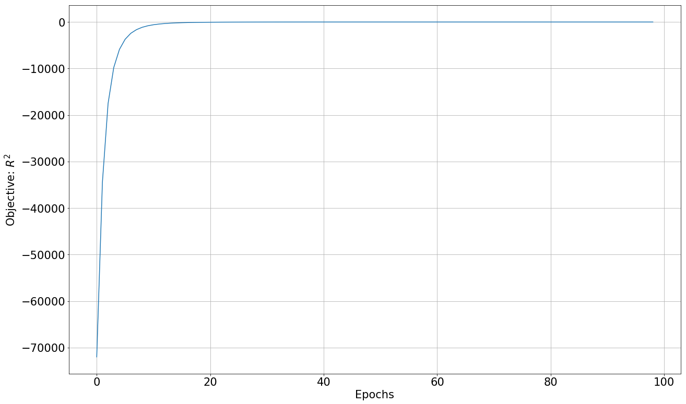
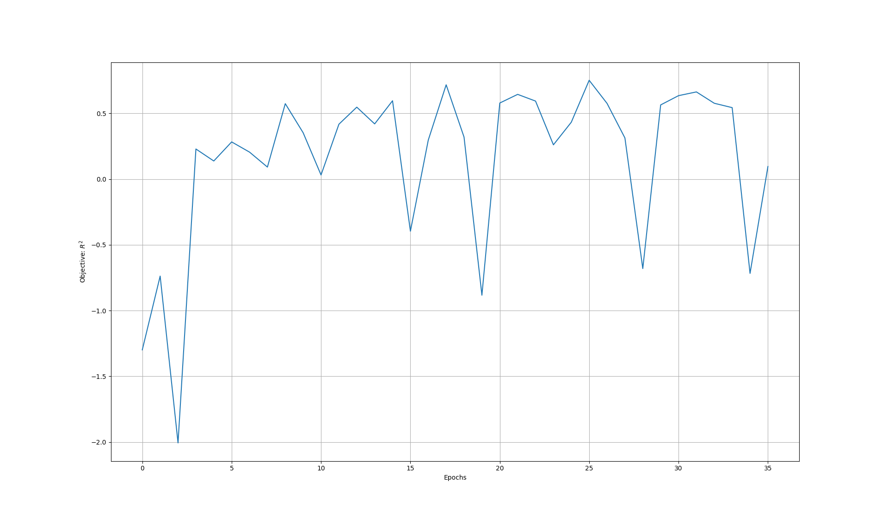

.. _tutorial-hps-deep-learning-basic:

Hyperparameter Search for Deep Learning (Basic)
***********************************************

Every DeepHyper search requires at least 2 Python objects as input:

 * ``run``: your "black-box" function returning the objective value to be maximized
 * ``Problem``: an instance of ``deephyper.problem.BaseProblem`` which defines the search space of input parameters to ``run``

These objects are required for both HPS and NAS, but take on a slightly different meaning in the context of NAS.

We will illustrate DeepHyper HPS using a regression example. We generate
synthetic data according to :math:`y = - \mathbf{x}^{T} \mathbf{x}` for random
:math:`N`-dimensional input vectors :math:`\mathbf{x}`. Our regression model
is a multilayer perceptron with 1 hidden layer, implemented in Keras.
Using HPS, we will then tune the model hyperparameters to optimize the validation :math:`R^{2}`
metric.

Setting up the problem
=======================

.. note::
    Be sure to work in a virtual environment where you can easily ``pip install`` new packages.
    This typically entails using either Anaconda, virtualenv, or Pipenv.

Let's start by creating a new DeepHyper project workspace. This a directory where you will create
search problem instances that are automatically installed and importable across your Python environment.

.. code-block:: console
    :caption: bash

    $ deephyper start-project hps_demo

A new ``hps_demo`` directory is created, containing the following files::

      hps_demo/
            hps_demo/
                __init__.py
            setup.py

We can now define DeepHyper search problems inside this directory, using either
``deephyper new-problem nas {name}`` or ``deephyper new-problem hps {name}`` for NAS
or HPS, respectively.

Let's set up an HPS problem called ``polynome2`` as follows:

.. code-block:: console
    :caption: bash

    $ cd hps_demo/hps_demo/
    $ deephyper new-problem hps polynome2

A new HPS problem subdirectory should be in place. This is a Python subpackage containing
sample code in the files ``__init__.py``, ``load_data.py``, ``model_run.py``, and ``problem.py``.
Overall, your project directory should look like::

      hps_demo/
            hps_demo/
                __init__.py
                polynome2/
                    __init__.py
                    load_data.py
                    model_run.py
                    problem.py
            setup.py

Generating data
===============

The sample ``load_data.py`` will generate the training and validation data for our demo regression problem.
While not required by the DeepHyper HPS API, it is helpful to encapsulate data loading and preparation in a separate module.
This sample generates data from a function :math:`f` where :math:`X \in [a, b]^n`  where :math:`f(X) = -\sum_{i=0}^{n-1} {x_i ^2}`:

.. literalinclude:: polynome2/load_data.py
    :linenos:
    :caption: polynome2/load_data.py
    :name: polynome2-load_data

You can test the ``load_data`` function:

.. code-block:: console
    :caption: bash

    python load_data.py

The expected output is:

.. code-block:: python
    :caption: [Out]

    train_X shape: (8000, 10)
    train_y shape: (8000, 1)
    valid_X shape: (2000, 10)
    valid_y shape: (2000, 1)

The Keras model
===================

``model_run.py`` contains the code for the neural network that we will train.

The model is implemented in the ``run()`` function below. We will provide this function to
DeepHyper, which will call it to evaluate various hyperparameter settings.
This function takes a ``point`` argument, which is a dictionary of
tunable hyperparameters. In this case, we will tune:

    * The number of units of the Dense hidden layer (``point['units']``)
    * The activation function of the Dense layer (``point['activation'])``
    * The learning rate of the RMSprop optimizer (``point['lr']``).

After training, the validation :math:`R^{2}` is returned by the ``run()`` function.  This return value is
the objective for maximization by the DeepHyper HPS search algorithm.

.. literalinclude:: polynome2/model_run_step_1.py
    :linenos:
    :caption: Step 1: polynome2/model_run.py
    :name: polynome2-model_run_step_1

.. note::

    Adding an ``EarlyStopping(...)`` callback is a good idea to stop the training of your model as soon as it is stops to improve.

    .. code-block:: python3

        ...
        callbacks=[EarlyStopping(
                            monitor='val_r2',
                            mode='max',
                            verbose=1,
                            patience=10
                        )]
        ...

We can first train this model to evaluate the baseline accuracy:

.. code-block:: console
    :caption: bash

    python model_run.py

.. code-block:: console
    :caption: [Out]

    objective: -0.00040728187561035154

Defining the HPS Problem space
==============================

The ``run`` function in ``model_run.py`` expects a hyperparameter dictionary with three keys: ``units, activation, and lr``.
We define the acceptable ranges for these hyperparameters with the ``Problem`` object inside ``problem.py`.
Hyperparameter ranges are defined using the following syntax:

    * Discrete integer ranges are generated from a tuple: ``(lower: int, upper: int)``
    * Continous parameters are generated from a tuple: ``(lower: float, upper: float)``
    * Categorical or nonordinal hyperparameters ranges can be given as a list of possible values: ``[val1, val2, ...]``

You probably have one or more "reference" sets of hyperparameters that are either hand-crafted or chosen by intuition.
To bootstrap the search with these so-called `starting points`, use the ``add_starting_point(...)`` method.

.. note::
    Several starting points can be defined with ``Problem.add_starting_point(**dims)``.
    All starting points will be evaluated before generating other evaluations.

.. literalinclude:: polynome2/problem_step_1.py
    :linenos:
    :caption: polynome2/problem.py
    :name: polynome2-problem-step-1

You can look at the representation of your problem:

.. code-block:: console
    :caption: bash

    python problem.py

The expected output is:

.. code-block:: console
    :caption: [Out]

    Problem
    { 'activation': [None, 'relu', 'sigmoid', 'tanh'],
    'lr': (0.0001, 1.0),
    'units': (1, 100)}

    Starting Point
    {0: {'activation': None, 'lr': 0.01, 'units': 10}}

Running the search locally
==========================

Everything is ready to run. Recall the Python files defining our experiment::

      polynome2/
            __init__.py
            load_data.py
            model_run.py
            problem.py

We have tested the syntax in all of these by running them individually. Now, let's put it all together by tuning the
3 hyperparameters with asynchronous model-based search (AMBS).

.. code-block:: console
    :caption: bash

    deephyper hps ambs --problem hps_demo.polynome2.problem.Problem --run hps_demo.polynome2.model_run.run

.. note::

    In order to run DeepHyper locally and on other systems we are using :ref:`evaluators`. For local evaluations we use the :ref:`subprocess-evaluator`.

.. note::

    Alternative to the command line above, paths to the ``problem.py`` and ``model_run.py`` files can be passed as arguments. DeepHyper
    requires that these modules contain an importable ``Problem`` instance and ``run`` callable, respectively.  It is your responsibility to ensure that any
    other modules imported in ``problem.py`` or ``model_run.py`` are in the Python import search path.

    We strongly recommend using a virtual environment with the ``start-project`` and ``new-problem`` command line tools. This ensures that
    any helper modules are easily accessible using the syntax ``import problem_name.helper_module``.

After the search is over, you will find the following files in your working directory:

.. code-block:: console

    deephyper.log
    results.csv
    results.json

.. include:: polynome2/dh-analytics-hps.rst

The best point the search found::

    point = {
        'activation': 'relu',
        'lr': 0.8820413612862609,
        'units': 21
    }

Just pass this ``point`` to your run function

.. literalinclude:: polynome2/model_run_step_1_point.py
    :linenos:
    :caption: Step 1: polynome2/model_run.py
    :name: polynome2-model_run_step_1_point

And run the script:

.. code-block:: console
    :caption: bash

    python model_run.py

.. code-block:: console
    :caption: [Out]

    objective:  0.47821942329406736

Running the search on ALCF's Theta and Cooley
==============================================

Now let's run the same search, but scale out to run parallel model evaluations
across the nodes of an HPC system such as Theta or Cooley. First create a Balsam database:

.. code-block:: console
    :caption: bash

    $ balsam init polydb

Start and connect to the ``polydb`` database:

.. code-block:: console
    :caption: bash

    $ source balsamactivate polydb

Set up the demo ``polynome2`` problem, as before:

.. code-block:: console
    :caption: bash

    $ deephyper start-project hps_demo
    $ cd hps_demo/hps_demo/
    $ deephyper new-problem hps polynome2

Use the ``balsam-submit`` command to set up and dispatch an ``AMBS`` job to the local scheduler:

.. code-block:: console
    :caption: bash

    $ deephyper balsam-submit hps polynome2_demo -p hps_demo.polynome2.problem.Problem -r hps_demo.polynome2.model_run.run  \
       -t 30 -q debug-cache-quad -n 4 -A datascience -j mpi

.. code-block:: console
    :caption: [Out]

    Validating Problem...OK
    Validating run...OK
    Bootstrapping apps...OK
    Creating HPS(AMBS) BalsamJob...OK
    Performing job submission...
    Submit OK: Qlaunch {   'command': '/lus/theta-fs0/projects/datascience/msalim/deephyper/deephyper/db/qsubmit/qlaunch12.sh',
        'from_balsam': True,
        'id': 12,
        'job_mode': 'mpi',
        'nodes': 4,
        'prescheduled_only': False,
        'project': 'datascience',
        'queue': 'debug-cache-quad',
        'scheduler_id': 370907,
        'state': 'submitted',
        'wall_minutes': 30,
        'wf_filter': 'test_hps'}
    **************************************************************************************************************************************
    Success. The search will run at: /myprojects/deephyper/deephyper/db/data/test_hps/test_hps_2ef063ce
    **************************************************************************************************************************************

Above, ``balsam-submit`` takes the following arguments:

    1. The first positional argument **mode** is either ``hps`` or ``nas``
    2. The second positional argument **workflow** must be a unique identifier for the run. An error will be raised if this workflow already exists.
    3. ``-p Problem`` and ``-r Run`` arguments define the search, as before
    4. ``-t 60`` indicates the walltime (minutes) of the scheduled job
    5. ``-n 4`` requests four nodes on which to run the search.  DeepHyper will automatically scale the search out across available nodes.
    6. ``-q Queue`` and ``-A Project`` pass the name of the job queue and project allocation to the HPC scheduler
    7. ``-j`` or ``--job-mode`` must be either ``mpi`` or ``serial``.  This controls how Balsam launches your ``model_runs``.

Once the search is done, you will find results in the directory shown in the banner:
``/myprojects/deephyper/deephyper/db/data/test_hps/test_hps_2ef063ce``.

.. note::

    The examples so far assume that your DeepHyper models run in the same Python
    environment as DeepHyper and each model runs on a single node.  If you need more control over
    model execution, say, to run containerized models, or to run data-parallel model
    training with Horovod, you can hook into the Balsam job controller. See :ref:`balsamjob_spec`
    for a detailed example.
