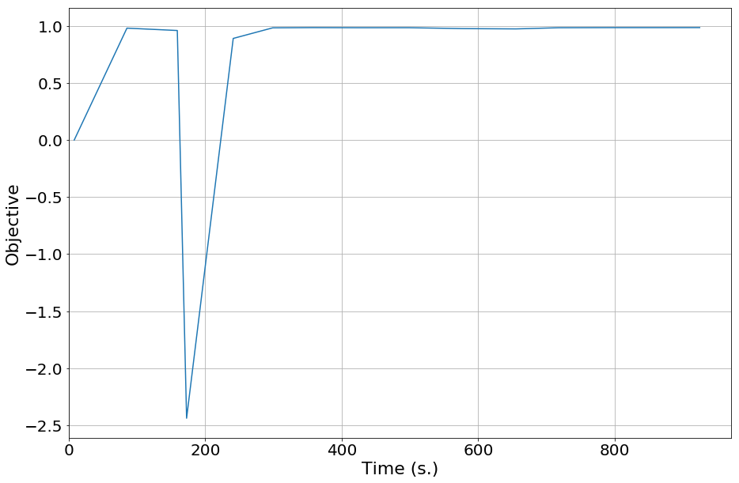
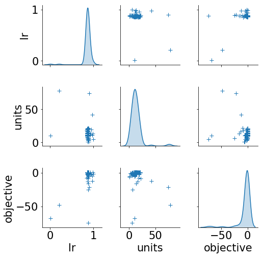
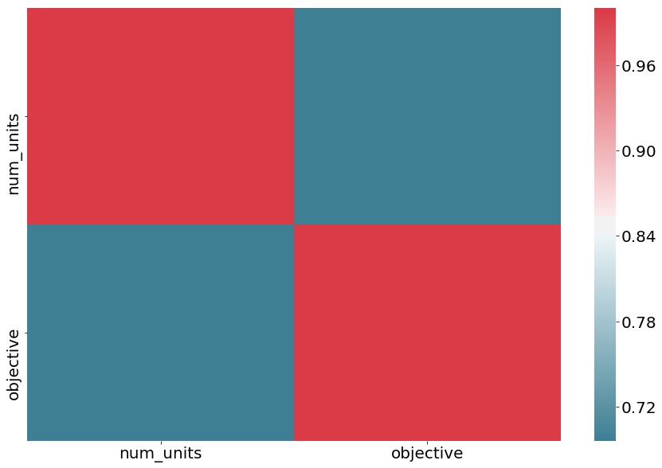

Deephyper analytics - hyperparameter search study
=================================================

**path to data file**: /Users/romainegele/polynome2/results.csv

for customization please see:
https://matplotlib.org/api/matplotlib\_configuration\_api.html

Setup & Data loading
--------------------

.. code:: ipython3

    path_to_data_file = '/Users/romainegele/polynome2/results.csv'

.. code:: ipython3

    import matplotlib
    import matplotlib.pyplot as plt
    import numpy as np
    import pandas as pd
    import seaborn as sns
    from pprint import pprint
    from datetime import datetime
    from tqdm import tqdm
    from IPython.display import display, Markdown
    
    width = 21
    height = 13
    
    matplotlib.rcParams.update({
        'font.size': 21,
        'figure.figsize': (width, height), 
        'figure.facecolor': 'white', 
        'savefig.dpi': 72, 
        'figure.subplot.bottom': 0.125, 
        'figure.edgecolor': 'white',
        'xtick.labelsize': 21,
        'ytick.labelsize': 21})
    
    df = pd.read_csv(path_to_data_file)
    
    display(Markdown(f'The search did _{df.count()[0]}_ **evaluations**.'))
    
    df.head()

The search did *11* **evaluations**.

.. raw:: html

    

    
    <table border="1" class="dataframe">
      <thead>
        <tr style="text-align: right;">
          <th></th>
          <th>activation</th>
          <th>lr</th>
          <th>units</th>
          <th>objective</th>
          <th>elapsed_sec</th>
        </tr>
      </thead>
      <tbody>
        <tr>
          <th>0</th>
          <td>NaN</td>
          <td>0.010000</td>
          <td>10</td>
          <td>-21.173921</td>
          <td>4.653887</td>
        </tr>
        <tr>
          <th>1</th>
          <td>sigmoid</td>
          <td>0.210479</td>
          <td>78</td>
          <td>-36.701882</td>
          <td>7.543147</td>
        </tr>
        <tr>
          <th>2</th>
          <td>sigmoid</td>
          <td>0.849683</td>
          <td>18</td>
          <td>-6.476073</td>
          <td>10.631713</td>
        </tr>
        <tr>
          <th>3</th>
          <td>tanh</td>
          <td>0.951716</td>
          <td>19</td>
          <td>-2.160431</td>
          <td>14.833839</td>
        </tr>
        <tr>
          <th>4</th>
          <td>sigmoid</td>
          <td>0.898754</td>
          <td>74</td>
          <td>-17.889413</td>
          <td>17.690615</td>
        </tr>
      </tbody>
    </table>
    

Statistical summary
-------------------

.. code:: ipython3

    df.describe()

.. raw:: html

    

    
    <table border="1" class="dataframe">
      <thead>
        <tr style="text-align: right;">
          <th></th>
          <th>lr</th>
          <th>units</th>
          <th>objective</th>
          <th>elapsed_sec</th>
        </tr>
      </thead>
      <tbody>
        <tr>
          <th>count</th>
          <td>100.000000</td>
          <td>100.000000</td>
          <td>100.000000</td>
          <td>100.000000</td>
        </tr>
        <tr>
          <th>mean</th>
          <td>0.898362</td>
          <td>70.640000</td>
          <td>-1.354364</td>
          <td>157.664431</td>
        </tr>
        <tr>
          <th>std</th>
          <td>0.115579</td>
          <td>27.161143</td>
          <td>4.706961</td>
          <td>91.122479</td>
        </tr>
        <tr>
          <th>min</th>
          <td>0.010000</td>
          <td>3.000000</td>
          <td>-36.701882</td>
          <td>4.653887</td>
        </tr>
        <tr>
          <th>25%</th>
          <td>0.903279</td>
          <td>56.500000</td>
          <td>-0.704031</td>
          <td>79.181544</td>
        </tr>
        <tr>
          <th>50%</th>
          <td>0.909080</td>
          <td>80.500000</td>
          <td>-0.230069</td>
          <td>155.298424</td>
        </tr>
        <tr>
          <th>75%</th>
          <td>0.920159</td>
          <td>90.250000</td>
          <td>-0.059919</td>
          <td>236.167535</td>
        </tr>
        <tr>
          <th>max</th>
          <td>0.995871</td>
          <td>100.000000</td>
          <td>0.731502</td>
          <td>318.685226</td>
        </tr>
      </tbody>
    </table>
    

Search trajectory
-----------------

.. code:: ipython3

    plt.plot(df.elapsed_sec, df.objective)
    plt.ylabel('Objective')
    plt.xlabel('Time (s.)')
    plt.xlim(0)
    plt.grid()
    plt.show()

Pairplots
---------

.. code:: ipython3

    not_include = ['elapsed_sec']
    sns.pairplot(df.loc[:, filter(lambda n: n not in not_include, df.columns)],
                    diag_kind="kde", markers="+",
                    plot_kws=dict(s=50, edgecolor="b", linewidth=1),
                    diag_kws=dict(shade=True))
    plt.show()

.. code:: ipython3

    corr = df.loc[:, filter(lambda n: n not in not_include, df.columns)].corr()
    sns.heatmap(corr, xticklabels=corr.columns, yticklabels=corr.columns, cmap=sns.diverging_palette(220, 10, as_cmap=True))
    plt.show()

Best objective
--------------

.. code:: ipython3

    i_max = df.objective.idxmax()
    df.iloc[i_max]

.. parsed-literal::

    activation         relu
    lr             0.900066
    units               100
    objective      0.731502
    elapsed_sec     314.882
    Name: 98, dtype: object

.. code:: ipython3

    dict(df.iloc[i_max])

.. parsed-literal::

    {'activation': 'relu',
     'lr': 0.9000663121003312,
     'units': 100,
     'objective': 0.7315017685890198,
     'elapsed_sec': 314.88191103935236}

