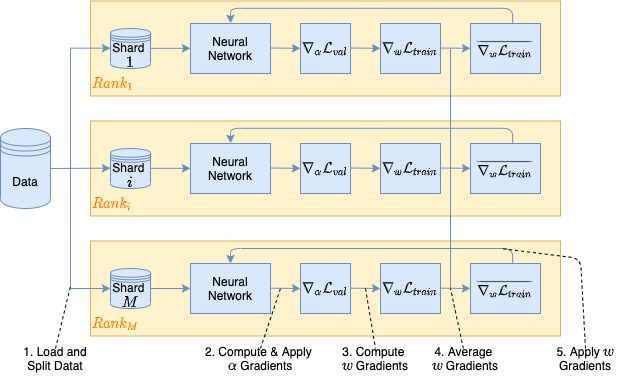

Data Parallelism
****************

Horovod
=======

The `Horovod software <https://github.com/horovod/horovod>`_ is used to do data parallel traininig with deep neural neworks. Data parallelism consists in spliting the original dataset in multiple parts and then performing an distributed computation of gradients as shown in the following image.

To use this feature the :class:`deephyper.evaluator.BalsamEvaluator` should be set for the search with ``--evaluator balsam``. Also, the ``-job-mode mpi`` has to be used when submitting the task with ``balsam submit-launch --job-mode mpi``. Then, 3 command line arguments are exposed to choose how to distribute the computation: ``--num-nodes-per-eval, --num-ranks-per-node, --num-threads-per-rank`` where:

- ``num-nodes-per-eval`` is the number of nodes used for each evaluation.
- ``num-ranks-per-node`` is the number of MPI ranks used for each evaluation.
- ``num-threads-per-rank`` is the number of threads per rank for each evaluation.

Neural Architecture Search (NAS)
--------------------------------

The available pipeline to use Horovod with NAS algorithms is ``deephyper.nas.run.horovod.run`` which has to be specified with the ``--run`` argument such as:

.. code-block:: console
    :caption: bash

    $ python -m deephyper.search.nas.regevo --problem deephyper.benchmark.nas.linearReg.Problem --evaluator balsam --max-evals 5 --num-nodes-per-eval 2 --num-ranks-per-node 1 --num-threads-per-rank 64 --run deephyper.nas.run.horovod.run

.. note::

    In the previous example we used a typical choice for Theta compute nodes by distributing the computation of each evalution on 2 nodes where each nodes has 64 threads.

Hyperparameter Search (HPS)
---------------------------

For HPS algorithm you simply have to follow the `Horovod documentation <https://horovod.readthedocs.io/>`_ to use it in the content of your ``run(...)`` function.

Ray
===

Tensorflow Distributed
----------------------

The :func:`deephyper.nas.run.tf_distributed.run` function is used to deploy a data-distributed training (on a single node) with ``tensorflow.distribute.MirroredStrategy``. It follows the same training pipeline as :func:`deephyper.nas.run.alpha.run`. Two hyperparameters arguments can be used to activate or deactivate the linear scaling rule (aka ``lsr``) for the learning rate and batch size, respectively:

.. code-block:: python

    Problem.hyperparameters(
        ...
        lsr_batch_size=True,
        lsr_learning_rate=True,
        ...
    )

The linear scaling rule consists in scaling the learning rate and batch size by the number of parallel GPUs used. For example if the initial learning rate and batch size are respectively 0.001 and 256 and one wants to use 2 GPUs for data-parallelism the scaled learning rate and batch size will be 0.002 and 512.

The warm up strategy for the learning rate can also be used to avoid big drops of accuracy when using data-parallelism. This strategy progressively (durin ``warmup_epochs``) increase the initial learning rate to the scaled learning rate:

.. code-block:: python

    Problem.hyperparameters(
        ...
        warmup_lr=True,
        warmup_epochs=5
        ...
    )

To launch a neural architecture search with data-parallelism you can use the ``ray-submit`` command line from DeepHyper. This command will generate a COBALT script and submit it automatically. Once the job starts, the script will first launch a Ray cluster and then start the search.

::

    deephyper ray-submit nas regevo -w combo_2gpu -n 1 -t 60 -A $PROJECTNAME -q full-node --problem nas_big_data.combo.problem_ae.Problem --run deephyper.nas.run.tf_distributed.run --max-evals 10000 --num-cpus-per-task 2 --num-gpus-per-task 2 -as ../SetUpEnv.sh