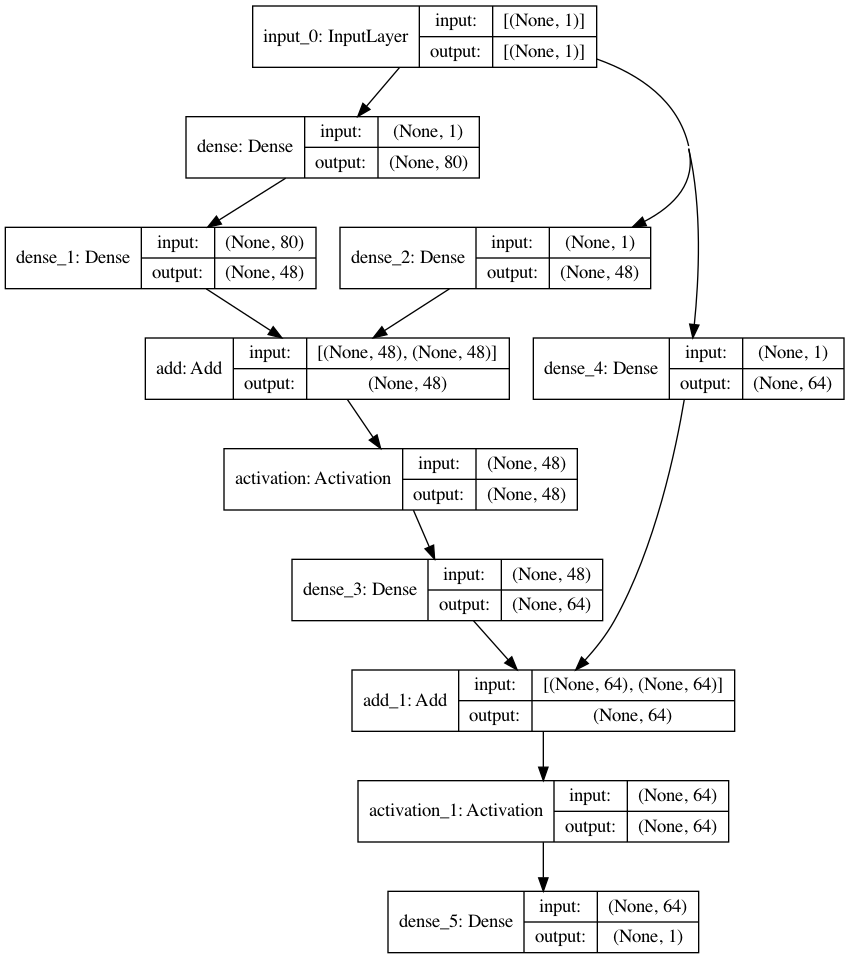
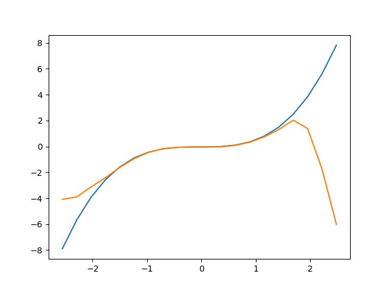
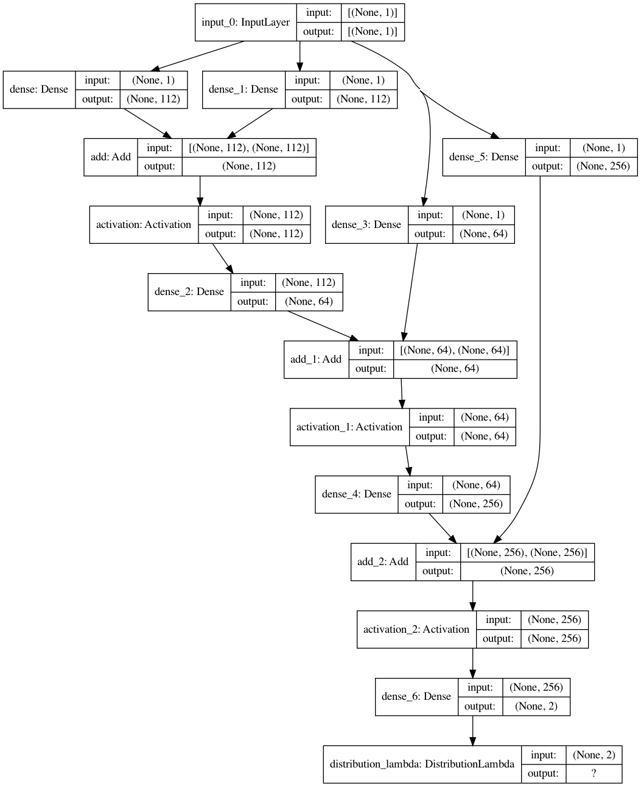
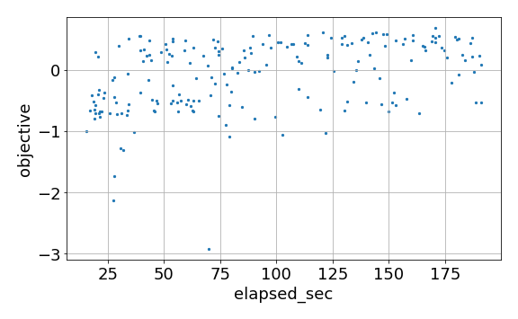
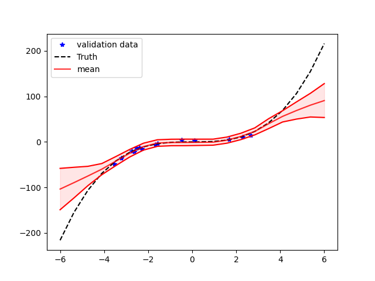

Deep Ensemble
*************

Setup the project
=================

This guide will show you how to build deep ensemble from scratch with DeepHyper. Start by create a ``dh_project`` with the following command line:

.. code-block:: bash

    deephyper start-project dh_project

.. note::

    The ``start-project`` command line is create a directory named ``dh_project`` containing a Python package (i.e., folder with ``__init__.py``) name ``dh_project`` and installing this package in editable mode in your current Python environment.

Ensemble with point-wise predictions
====================================

Then move to the ``dh_project`` package and create a new problem folder named ``cubic``:

.. code-block:: bash

    cd dh_project/dh_project/
    deephyper new-problem nas cubic

The previous command will create 4 files containing default code to run a Neural Architecture Search::

    cubic/__init__.py # Necessary to define a Python sub-package
    cubic/load_data.py # Responsible of providing a function to load the data
    cubic/search_space.py # Responsible of providing a function to build a search space
    cubic/problem.py # Responsible of defining the loss to optimize, and the different settings

Now, we will start by editing the ``load_data.py`` file to generate data corresponding to a Cubic curve. We will first generate data for a training set (used to train neural networks during hyperparameter or neural architecture search) and a testing set (used to evaluate the final performance). Then the training set will be sub-divided in a new training set and validation set. The training data will be generated between [-4;4] and we will add a normal noise on the target values. The code  for the training data is then corresponding to:

.. literalinclude:: cubic/load_data.py
    :lines: 7-9

Now, we need to split the training, validation and testing data. One function has to return ``sub_training, validation`` and an other function has to return ``training, testing``. We respectively name these functions ``load_data_train_valid`` and ``load_data_train_test`` where the corresponding code is:

.. literalinclude:: cubic/load_data.py

If you run the previous script with ``python load_data.py`` you should have the following output::

    train_X shape: (26, 1)
    train_y shape: (26, 1)
    valid_X shape: (14, 1)
    valid_y shape: (14, 1)

After defining a correct ``load_data`` function let us define the neural architecture search space. We will now edit the ``search_space.py`` file to define a architecture space of fully connected neural networks with skip-connexions. To do so, we will start by defining the ``RegressionFactory`` by implementing the ``def build(self, ...)`` method. Then we will wrap this factory into a ``create_search_space`` function to follow the DeepHyper problem definition API.

We will start with the full-code to define the search space and then explain the different pieces of the puzzle.

.. literalinclude:: cubic/search_space.py

The Neural Architecture Search API in DeepHyper rely on a direct acyclic graph (DAG) definition to describe a search space. In this DAG the each node has a list of possible operations. For example, it can be the identity function, a fully connected layer with 10 units, a convolution layer so on and so forth. To transform a Keras layer from ``tensorflow.keras`` into an operation it is convenient to use the ``operation`` function (or decorator).

.. literalinclude:: cubic/search_space.py
    :lines: 11-13

In the previous excerpt of code the ``Dense`` returned by ``operation(Dense)`` is not a Keras layer anymore but a DeepHyper Operation. Then, we need to define the ``RegressionFactory`` which interface requires us to implement the ``build(self, input_shape, output_shape, ...)`` method.

.. literalinclude:: cubic/search_space.py
    :lines: 30-48

In this method we start by creating a ``KSearchSpace`` (i.e., the DAG we mentionned before). Then, the possible operations are defined within the ``self.build_sub_graph(...)`` call. The output is defined with ``node2 = ConstantNode(op=Dense(output_dim))`` where we want to impose a specific operation. In this API the connections between nodes of the graph are defined with ``self.ss.connect(node_1, node_2)``.

The core of the search space is defined in ``self.build_sub_graph(...)`` with the following code:

.. literalinclude:: cubic/search_space.py
    :lines: 50-79

The ``anchor_points`` is used to create the possible skip-connexions. In this case we decided to create skip-connections with the 3 previous node's outputs. The ``for _ in range(num_layers)`` loop defines the maximal number of layers we want.

Then for each new possible layer a ``VariableNode`` is create and a list of operations are added to it with:

.. literalinclude:: cubic/search_space.py
    :lines: 57-58

The possible operations for each variable node are defined with the following code:

.. literalinclude:: cubic/search_space.py
    :lines: 81-85

For the skip-connexions we use the ``anchor_points`` to queue the last created nodes as well as the ``Zero`` (i.e., no connexion) and ``Connect`` (i.e., connexion) operations:

.. literalinclude:: cubic/search_space.py
    :lines: 69-72

Because, we are creating skip-connexions we also need to define how to merge the tensors if a connexion is active. To do so we use the ``AddByProjecting`` operation such as:

.. literalinclude:: cubic/search_space.py
    :lines: 65-66

The ``AddByProjecting`` operation will do a linear projections of the ``[1:]`` incoming tensors to the match the shape of the tensor of index 0 and then will add all of these tensors.

To generate a random model from the search space we can execute the ``search_space.py`` script which ends with:

.. literalinclude:: cubic/search_space.py
    :lines: 92-95

and save a ``random_model.png`` file which can look like the following image:

.. note::

    The shapes ``shapes = dict(input_shape=(1,), output_shape=(1,))`` passed to the ``create_search_space`` or ``def build(self, ...)`` functions are the shape of each samples in the data set. These tuples are not including the number of points in the array.

After defining the functions to load the data and create the search space we need to define the problem and its settings. To do this we will edit the ``problem.py`` file. A neural architecture search problem alone will look like the following code:

.. literalinclude:: cubic/problem.py

In this problem, only the neural network hyperparameters are searched. All other hyperparameters such as ``batch_size, learning_rate, optimizer`` are fixed for all generated neural networks during the search. In Deephyper it is also possible to jointly optimize the neural architecture and the remaining hyperparameters and we show how to do this in the following example:

.. literalinclude:: cubic/problem_agebo.py

where the hyperparameters are not constant anymore:

.. literalinclude:: cubic/problem_agebo.py
    :lines: 22-36

.. note::

    The ``ModelCheckpoint`` callback is essential to save trained models that we will use to build the ensemble later.

To visualize and verify the good definition of this problem we can execute the ``problem.py`` script which will output the following:

::

    Problem is:
    * SEED = 42 *
    - search space   : dh_project.cubic.search_space.create_search_space
    - data loading   : dh_project.cubic.load_data.load_data_train_valid
    - preprocessing  : deephyper.nas.preprocessing.preprocessing.stdscaler
    - hyperparameters:
        * verbose: 0
        * batch_size: batch_size, Type: UniformInteger, Range: [1, 20], Default: 10
        * learning_rate: learning_rate, Type: UniformFloat, Range: [0.0001, 0.1], Default: 0.0031622777, on log-scale
        * optimizer: optimizer, Type: Categorical, Choices: {sgd, rmsprop, adagrad, adam, adadelta, adamax, nadam}, Default: sgd
        * patience_ReduceLROnPlateau: patience_ReduceLROnPlateau, Type: UniformInteger, Range: [3, 30], Default: 16
        * patience_EarlyStopping: patience_EarlyStopping, Type: UniformInteger, Range: [3, 30], Default: 16
        * num_epochs: 100
        * callbacks: {'ReduceLROnPlateau': {'monitor': 'val_loss', 'mode': 'min', 'verbose': 0, 'patience': 5}, 'EarlyStopping': {'monitor': 'val_loss', 'mode': 'min', 'verbose': 0, 'patience': 10}, 'ModelCheckpoint': {'monitor': 'val_loss', 'mode': 'min', 'save_best_only': True, 'verbose': 0, 'filepath': 'model.h5', 'save_weights_only': False}}
    - loss           : mse
    - metrics        :
        * r2
        * rmse
    - objective      : -val_loss
    - post-training  : None

Now that we have all of the components ready, that is the functions loading the data, the search space and the problem, we can run a search to generate all the models we need.

.. code-block:: bash

    deephyper nas agebo --problem dh_project.cubic.problem.Problem --max-evals 200 --evaluator ray --ray-address ''

.. note::

    The ``agebo`` search stands for Aging Evolution (AgE) with Bayesian optimization. It is a search algorithm that combines a genetic algorithm to evolve the neural architectures and a Bayesian optimizer to sample other hyperparameters. Other joint HPS+NAS algorithm can be used in DeepHyper such as: ``regevomixed`` and ``ambsmixed`` which corresponding to a genetic algorithm and Bayesian optimization, respectively.

After running the search you will find the following generated files in you current directory:

::

    deephyper.log
    save/
    init_infos.json
    results.csv

To have a quick overview of what happened during the search DeepHyper is providing the ``deephyper-analytics`` command line. With this command line you can visualize the evolution of the objective during the search:

.. code-block:: bash

    deephyper-analytics quickplot results.csv

.. image:: cubic/Figure_1.png
    :scale: 80 %
    :alt: objective vs time with quickplot
    :align: center

and you can also output the Top-k configurations:

.. code-block:: bash

    deephyper-analytics topk results.csv -k 5

::

    '0':
        arch_seq: '[143, 1, 169, 0, 1]'
        batch_size: 10
        elapsed_sec: 77.4903900623
        id: d9e0c18c-d845-11eb-862c-acde48001122
        learning_rate: 0.0840470082
        objective: -0.013813436
        optimizer: adamax
        patience_EarlyStopping: 23
        patience_ReduceLROnPlateau: 29
    '1':
        arch_seq: '[49, 1, 174, 0, 1]'
        batch_size: 15
        elapsed_sec: 49.6640861034
        id: c986f6f8-d845-11eb-862c-acde48001122
        learning_rate: 0.0122515359
        objective: -0.0142777488
        optimizer: adam
        patience_EarlyStopping: 18
        patience_ReduceLROnPlateau: 29
    '2':
        arch_seq: '[147, 1, 85, 1, 0]'
        batch_size: 10
        elapsed_sec: 78.0288829803
        id: da34fff4-d845-11eb-862c-acde48001122
        learning_rate: 0.0487784248
        objective: -0.0145491725
        optimizer: adam
        patience_EarlyStopping: 15
        patience_ReduceLROnPlateau: 25
    '3':
        arch_seq: '[143, 1, 169, 1, 1]'
        batch_size: 10
        elapsed_sec: 70.1752860546
        id: d58a072e-d845-11eb-862c-acde48001122
        learning_rate: 0.0171250147
        objective: -0.0150675001
        optimizer: adam
        patience_EarlyStopping: 24
        patience_ReduceLROnPlateau: 30
    '4':
        arch_seq: '[147, 1, 85, 1, 0]'
        batch_size: 11
        elapsed_sec: 44.0345909595
        id: c487234e-d845-11eb-862c-acde48001122
        learning_rate: 0.0956038507
        objective: -0.0151032014
        optimizer: adamax
        patience_EarlyStopping: 24
        patience_ReduceLROnPlateau: 29

.. note::

    The ``arch_seq`` corresponds to the choice of operations for each node of the ``KSearchSpace`` that we defined previously in the ``RegressionFactory``. Therefore, one neural network corresponds to a list of integer values.

Inside the ``save/`` folder you will find the following data:

::

    config/ # saved configuration that were directly passed to the run function
    history/ # saved history the training of each neural networks (metrics information)
    model/ # saved neural networks with the ModelCheckpoint callback

Now that we have a catalog of models saved in ``saved/model`` we can create an ensemble with the Python API in a script named ``ensemble.py``:

.. literalinclude:: cubic/ensemble.py

Then we execute the script with ``python ensemble.py`` which gives the following output:

::

    scaled valid loss:  {'loss': 0.008596132415829414}
    scaled test loss:  {'loss': 13.490530871948746}
    reversed scaling valid loss:  6.484838618112436
    reversed scaling test loss:  10177.127525878732

where the best objective was ``0.0138`` before we are now at ``0.0086``! If we now do a visualize on the test set we can see that the [-4,4] range used for the training is learned very well however the remaining part have a big error. We will see how to deal with this by using ``UQBaggingEnsembleRegressor``.

Ensemble with uncertainty quantification
========================================

Now, we would like to build ensembles from models with distributions as outputs. Therefore, we move back to the ``dh_project`` package and create a new problem folder named ``cubicuq`` (uq stands for uncertainty quantification):

.. code-block:: bash

    cd ..
    deephyper new-problem nas cubicuq

The ``load_data.py`` is the same as before therefore we can simply copy the file:

.. code-block:: bash

    cp cubic/load_data.py cubicuq/

The search space and problem definitions will have small differences with the point-wise prediction so we can also copy them:

.. code-block:: bash

    cp cubic/problem.py cubicuq/
    cp cubic/search_space.py cubicuq/
    cd cubicuq/

For the search space, instead of outputing point-wise predictions we now want to predict a Normal distribution for each output variable. First, we import the ``DistributionLambda`` from Tensorflow Probability:

.. code-block:: python

    import tensorflow_probability as tfp
    tfd = tfp.distributions

    ...

    DistributionLambda = operation(tfp.layers.DistributionLambda)

Then, we modify the output of the search space to have predict and learn distributions:

.. literalinclude:: cubicuq/search_space.py
    :lines: 43-62

As a result the complete ``cubicuq/search_space.py`` is now:

.. literalinclude:: cubicuq/search_space.py

We can generate a random model from this new search space to see the difference:

.. code-block:: bash

    python search_space.py

For the problem we need to adapt the imports using ``cubic`` to ``cubicuq``:

.. literalinclude:: cubicuq/problem.py
    :lines: 3-4

Then, we will change the loss function and the metrics. For the loss function we will use the negative log-likelihood to measure the quality of learned uncertainties. For the metrics, we do not have other metrics to compute from the learned distributions so we will keep the list empty:

.. literalinclude:: cubicuq/problem.py
    :lines: 50-52

As a result the complete ``cubicuq/problem.py`` is now:

.. literalinclude:: cubicuq/problem.py

Now that we have all the components ready, that is the functions loading the data, the search space and the problem, we can run a search to generate all the models we need.

.. code-block:: bash

    deephyper nas agebo --problem dh_project.cubicuq.problem.Problem --max-evals 200 --evaluator ray --ray-address ''

After running the search you will find the following generated files in you current directory:

::

    deephyper.log
    save/
    init_infos.json
    results.csv

To have a quick overview of what happened during the search we can use the ``deephyper-analytics`` command line:

.. code-block:: bash

    deephyper-analytics quickplot results.csv

and you can also output the Top-k configurations:

.. code-block:: bash

    deephyper-analytics topk results.csv -k 1

::

    '0':
        arch_seq: '[74, 1, 121, 0, 0]'
        batch_size: 1
        elapsed_sec: 170.5478639603
        id: f051ba46-d8d3-11eb-ad52-acde48001122
        learning_rate: 0.0037099058
        objective: 0.6833058596
        optimizer: nadam
        patience_EarlyStopping: 23
        patience_ReduceLROnPlateau: 16

Now that we have a catalog of models saved in ``saved/model`` we can create an ensemble with the Python API in a script named ``ensemble.py``:

.. literalinclude:: cubicuq/ensemble.py

Then we execute the script with ``python ensemble.py`` which gives the following output:

::

    scaled valid loss:  {'loss': -0.69923145}
    scaled test loss:  {'loss': 3.0383315}

where the best objective was ``-0.683`` before we are now at ``-0.699``! If we now do a visualize on the test set we can see that the [-4,4] range used for the training is learned very well. Also, contrary to the point-wise prediction we can see that the uncertainty is growing where the model is becoming less certain.

