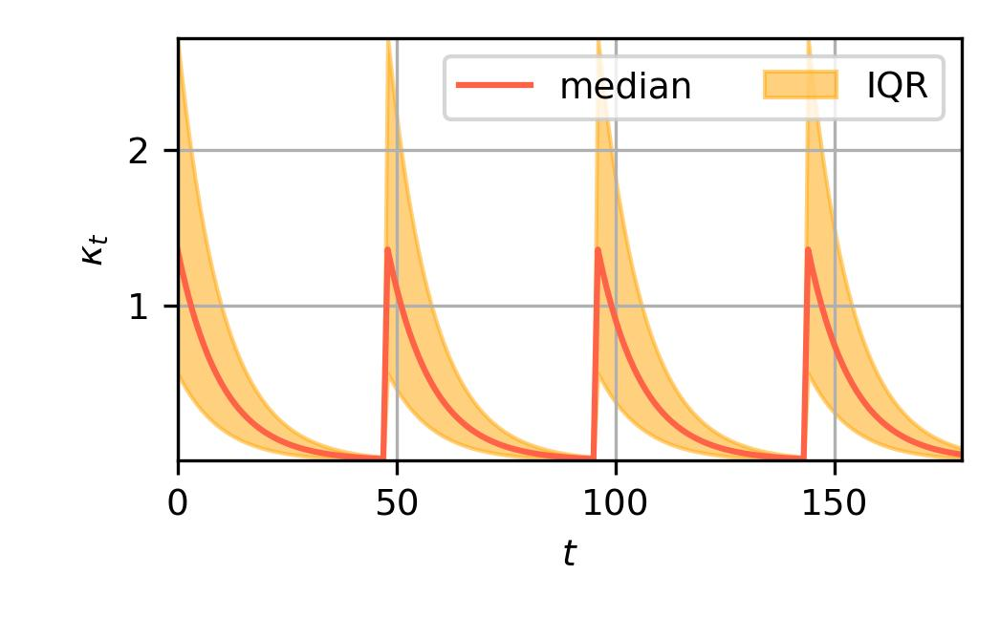

{width=40%}

# Summary

Machine learning models are increasingly applied across scientific disciplines, yet their effectiveness often hinges on heuristic decisions—such as data transformations, training strategies, and model architectures—that are not learned by the models themselves. Automating the selection of these heuristics and analyzing their sensitivity is crucial for building robust and efficient learning workflows. `DeepHyper` addresses this challenge by democratizing hyperparameter optimization, providing accessible tools to streamline and enhance machine learning workflows from a laptop to the largest supercomputer in the world. Building on top of hyperparameter optimization it unlock new capabilities around ensembles of models for improved accuray and uncertainty quantification. All of these organized around efficient parallel computing.

# Statement of need

`DeepHyper` is a Python package for parallel hyperparameter optimization or neural architecture search.
The project started in 2018 [@balaprakash2018deephyper] with a focus on making Bayesian optimization more efficient on high-performance computing clusters.
It provides access to a variety of asynchronous parallel black-box optimization algorithms `deephyper.hpo`. The 
software offers a variety of parallel programming backends such as Asyncio, threading, processes, Ray, and MPI `deehyper.evaluator`. The hyperparameter optimization can be single or multi-objective, composed of mixed variables,
using explicit or hidden constraints, and benefit from early-discarding strategies `deephyper.stopper`. Leveraging the results of hyperparameter optimization or neural architecture search it provides parallel ensemble algorithms `deephyper.ensemble` that can help improve accuracy or quantify disentangled predictive uncertainty. A diagram of our software architecture is shown in Figure 1.

{width=60%}

`DeepHyper` was designed to help research in the field of automated machine learning and also to be used out-of-the box
in scientific projects where learning workflows are being developed.

# Related Work

Numerous software packages now exist for hyperparameter optimization (HPO), including:

- [HyperMapper]()
- [Optuna](https://optuna.readthedocs.io)
- [Hyperopt]()
- [BoTorch]()
- [OpenBox]()
- [HpBandSter]()
- [SMAC](https://automl.github.io/SMAC3)

These tools differ in scope and design: some are research-oriented (e.g., SMAC), while others prioritize production-readiness and usability (e.g., Optuna). In this section, we focus our comparison on SMAC and Optuna, which are representative of these two directions.

**DeepHyper** is designed to maximize HPO efficiency across a wide range of parallelization scales, from sequential (single-core) runs to massively parallel evaluations on high-performance computing (HPC) systems with thousands of cores.

## Feature Comparison

While the feature matrix below provides a high-level overview, it necessarily simplifies some nuanced implementation differences.

### Hyperparameter Optimization Capabilities

| Feature                 | DeepHyper | Optuna | SMAC3 |
|------------------------|-----------|--------|--------|
| Single-objective       | X        | X     | X     |
| Multi-objective        | X        | X     | X     |
| Early stopping         | X        | X     | X     |
| Fault tolerance        | X        | X     | .     |
| Transfer learning      | X        | X     | ~     |
| Ensemble construction  | X        | .     | .     |
| Visualization          | ~        | X     | .     |

**Single-objective Optimization**  
DeepHyper employs a surrogate model based on random forests to estimate $P(\text{Objective} \mid \text{Hyperparameters})$, similar to SMAC. However, DeepHyper's implementation is typically faster per query, especially when the number of evaluations exceeds 200. In contrast, Optuna uses the Tree-structured Parzen Estimator (TPE), which models $P(\text{Hyperparameters} \mid \text{Objective})$. TPE offers faster query times but can struggle with complex optimization landscapes and tends to be less effective in refining continuous hyperparameters.

**Multi-objective Optimization**  
DeepHyper uses scalarization-based approaches inspired by ParEGO (also used in SMAC), with randomized weights and a variety of scalarization functions. While Optuna defaults to MoTPE, we observed improved performance using NSGA-II, a genetic algorithm that evolves solutions along estimated Pareto fronts (available in Optuna). NSGA-II typically converges more slowly but catches up when the evaluation budget is sufficient.

**Early Discarding**  
DeepHyper supports several early stopping techniques, including constant thresholds, median stopping rules, successive halving, and learning curve extrapolation. Optuna also offers several early discarding methods among which some are different from DeepHyper's.

**Fault Tolerance**  
DeepHyper handles failed evaluations by assigning them the worst observed objective value, thereby preserving optimizer stability and avoiding cascading failures.

**Transfer Learning**  
DeepHyper supports warm-starting optimizations using data from prior runs. This is effective when either the objective function changes while the search space remains fixed (e.g., different datasets), or when the search space expands (e.g., broader neural architecture configurations).

**Ensemble Construction**  
DeepHyper enables model ensembling from the pool of evaluated configurations, helping to reduce variance and capture epistemic uncertainty in predictions.

**Visualization**  
Basic visualization tools are provided via `deephyper.analytics`. For more interactive exploration, we recommend [SandDance](https://microsoft.github.io/SandDance/), a Visual Studio Code plugin. Figure 2 illustrates a 3D visualization of a Random Forest optimization, with `min_samples_split`, `min_weight_fraction_leaf`, and test accuracy as the x, y, and z axes (and color), respectively. The two plots compare configurations using `splitter="best"` (left) and `splitter="random"` (right). Such visualizations help identify the sensitivity of the objective to different hyperparameters.

{width=80%,label="sanddance_viz"}

### Parallelization Capabilities

|   | DeepHyper | Optuna | SMAC3 |
|---|-----------|--------|-------|
| Asynchronous optimization  | X | X | ? |
| Centralized  optimization  | X | X | . |
| Decentralized optimization | X | X | . |
| Parallelization backends   | X | . | ~ |
| Memory backends            | X | X | ~ |

The main difference between DeepHyper, Optuna and SMAC related to parallelization is that DeepHyper provides out-of-the-box parallelization software while Optuna leaves it to the user and SMAC limits itself to centralized parallelism with Dask.

**Asynchronous optimization**: DeepHyper's allows to submit and gather hyperparameter configuration by batch and asynchronously (in a centralized or decentralized setting).

**Centralized optimization**: DeepHyper's allows to run centralized optimization, including $1$ master running the optimizationa and $N$ workers evaluating hyperparameter configurations.

**Decentralized optimization**: DeepHyper's allows to run decentralized optimization,
including $N$ workers, each running centralized optimization.

**Parallelization backends**: DeepHyper's provides compatibility with several parallelization backends: AsyncIO functions, thread-based, process-based, Ray, and MPI. This allows to easily adapt to the context of the execution.

**Memory backends**:: DeepHyper's provides compatibility with several shared-memory backends: local memory, server managed memory, MPI-based remote memory access, Ray.

## Black-box Optimization Benchmarks

Average regret (i.e., $y^* - \hat{y}^*$) and standard error over 10 random repetition for each method.
All methods are run sequentialy with default arguments.
For DeepHyper, the `CBO` optimizer is used.
For Optuna, the `TPE` optimizer is used.
For SMAC, the default parameters using the OptunaHub SMAC sampler is used.

{width=45%}

{width=45%}

{width=45%}

{width=45%}

{width=45%}

{width=45%}

{width=45%}

{width=45%}

{width=45%}

# Black-box Optimization Methods

The algorithms used for hyperparameter optimization are black-box optimization algorithms for mixed search spaces.
A mixed search space, can be composed of real, discrete, or categorical (nomimal or ordinal) values.
The search space can also include constraints (e.g., explicit such as $x_0 < x_1$, or implicit such as "unexpected out-of-memory error").
The objective function can be stochastic $Y = f(x)$ where $Y$ is a random variable, $x$ is a vector of input hyperparameters and $f$ is the objective function. `DeepHyper` main hyperparameter optimization algorithm is based on Bayesian optimization.

The Bayesian optimization of `DeepHyper` relies by default on Extremely Randomized Forest as surrogate model to estimate $E_Y[Y|X=x]$.
Extremely Randomized Forest [@geurts2006extremely] are a kind of Randomized Forest algorithm where the split decision involves a random process for each newly created node of a tree.
It provides smoother epistemic uncertainty estimates with an increasing number of trees (Figure 12) compared to usual Random Forests that use a deterministic "best" split decision (Figure 13).

{width=45%,label="randomsplit"}

{width=45%,label="bestsplit"}

Then, a custom acquisition function `UCBd`, focuses on the epistemic uncertainty of this surrogate (purple area in Figure 13) for improved efficiency.
It is also combined with a periodic exponential decay (Figure 14, impacting exploration-exploitation parameters of BO) to escape local solutions [@egele2023asynchronous].

{width=49%}

Batch parallel genetic algorithms are provided to resolve efficiently the sub-problem of optimizing the acquisition function and it is also more accurate than Monte-Carlo approches to find the optimum of the acquisition function.
A cheap and efficient multi-point acquisition strategy `qUCBd` is provided for better parallel scalability [@egele2023asynchronous].

The multi-objective optimization is enabled by scalarization functions and objective rescaling [@egele2023dmobo].

The early-discarding strategies include asynchronous successive halving and a robust learning curve extrapolation [@egele2024unreasonable].

The ensemble strategies is modular to allow: exploring models tested during hyperparameter optimization, classification and regression problems to be treated, disentangled uncertainty quantification [@egele2022autodeuq].

A transfer-learning strategy for hyperparameter optimization [@dorier2022transferlearning] is also available. This strategy used to be based on variational auto-encoders for tabular data. It is now based on Gaussian mixture-model for tabular data.

# Acknowledgements

We acknowledge contributions from Misha Salim, Romit Maulik, Venkat Vishwanath, Stefan Wild, Joceran Gouneau, Dipendra Jha, Kyle Felker, Matthieu Dorier, Felix Perez, Bethany Lush, Gavin M. Wiggins, Tyler H. Chang, Yixuan Sun, Shengli Jiang, rmjcs2020, Albert Lam, Taylor Childers, Z223I, Zachariah Carmichael, Hongyuan Liu, Sam Foreman, Akalanka Galappaththi, Brett Eiffert, Sun Haozhe, Sandeep Madireddy, Adrian Perez Dieguez, and Nesar Ramachandra. 
We also would like to thank Prof. Isabelle Guyon for her guidance on the machine learning methodologies developed in this software.

# References